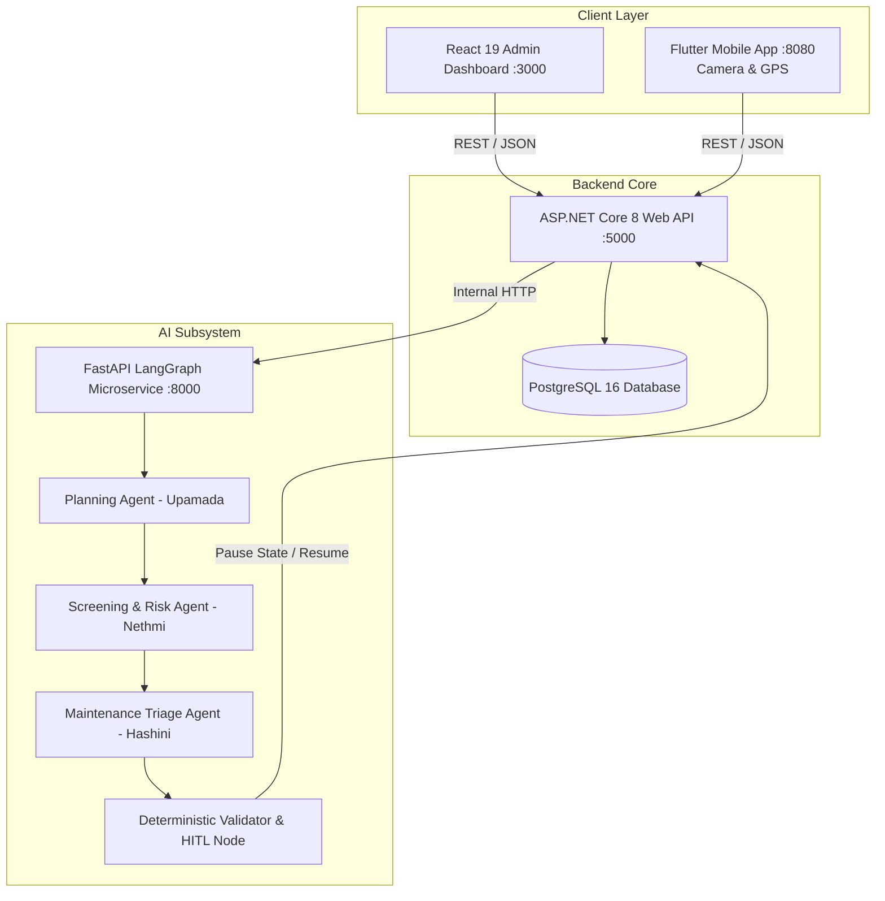

# Rental Management System (RMS)
## Integrated Full-Stack and Multi-Agent Agentic AI Enterprise Platform

[](https://github.com/IT24200314/SE3090-RMS/actions/workflows/ci.yml)
[](https://dotnet.microsoft.com/)
[](https://react.dev/)
[](https://flutter.dev/)
[](https://python.langchain.com/docs/langgraph)
[](https://www.postgresql.org/)

---

## 📌 Project Overview & SE3090 Alignment

The **Rental Management System (RMS)** is a comprehensive full-stack and autonomous Agentic AI application engineered for the **SLIIT SE3090 (Software Engineering Frameworks)** module.

### Group Members & Component Allocation (3-Member Approved Team):
1. **Upamada Ekanayake (Leader - IT24200314)**:
   - **Component A**: Property Listing & Lease Lifecycle Management
   - **Agentic AI**: Planning & Coordination Agent (`planner.py`)
2. **Nethmi Seya (IT24200314-M2)**:
   - **Component B**: Tenant Screening & Onboarding Management
   - **Agentic AI**: Tenant Screening & Risk Scoring Agent (`tenant_agent.py`)
   - **Native Mobile Feature**: Camera KYC Document Capture
3. **Hashini Wicramathilake (IT24200314-M3)**:
   - **Component C**: Maintenance & Work-Order Operations
   - **Agentic AI**: Maintenance Triage & Dispatch Agent (`maintenance_agent.py`) & Deterministic Validator Node (`validator.py`)
   - **Native Mobile Feature**: GPS Geolocation Tagging

---

## 🏛️ System Architecture



---

## 🔄 Cross-Platform Human-in-the-Loop (HITL) Workflow

1. **Mobile Submission**: Tenant submits emergency maintenance request on Flutter app with photo and device GPS coordinates.
2. **Persistence**: ASP.NET Core saves ticket in PostgreSQL with `Open` status and audit fields.
3. **AI Triage**: ASP.NET Core triggers LangGraph workflow.
4. **Planning & Triage**: Planning Agent builds plan $\rightarrow$ Maintenance Agent classifies problem as `Plumbing Services` and estimates repair budget at LKR 65,000.
5. **Deterministic Guardrail**: Validator identifies estimate $\ge$ LKR 50,000 threshold $\rightarrow$ pauses state at `PENDING_APPROVAL`.
6. **HITL Review**: Property manager views **High-Cost Approval Card** on React dashboard and clicks `Authorize Repair`.
7. **Resolution**: Status updates to `Assigned` with contractor dispatched $\rightarrow$ Flutter app updates status.

---

## 🧪 Automated Testing & CI/CD Pipeline

The repository includes comprehensive automated tests running on GitHub Actions:
- **Backend xUnit Suite**: 9 unit and service tests verifying business logic, state machines, and constraints.
- **AI Agent Pytest Suite**: 8 automated test cases verifying LangGraph node plans, risk scoring, and HITL pauses.
- **Frontend Vite Build**: Production bundle check with 0 warnings.
- **Flutter Analysis**: Static code analysis and widget architecture checks.

### Running Tests Locally:

```powershell
# 1. Run Backend xUnit Tests
dotnet test backend/RMS.Backend.sln

# 2. Run AI Agent Pytest Tests
ai-agent\venv\Scripts\pytest ai-agent/tests

# 3. Build React Frontend
npm --prefix frontend run build
```

---

## 🚀 Quick Startup Guide

### Prerequisites
- .NET 8 / 10 SDK
- Node.js v20+ & npm
- Python 3.11+ with venv

```powershell
# 1. Start AI Microservice (Port 8000)
cd "ai-agent"
.\venv\Scripts\Activate.ps1
uvicorn main:app --host 0.0.0.0 --port 8000

# 2. Start ASP.NET Core API (Port 5000)
cd "backend\RMS.API"
dotnet run

# 3. Start React Web Dashboard (Port 3000)
cd "frontend"
npm run dev

# 4. Start Flutter Mobile App (Port 8080)
cd "mobile"
flutter run -d chrome --web-port 8080
```

---

## 📚 Technical Documentation & Reports

- 📄 [Consolidated Technical Report & Viva Guide](file:///docs/SE3090_CONSOLIDATED_REPORT.md)
- 🗄️ [Database ERD & PostgreSQL Schema](file:///docs/DATABASE_ERD.md)
- 📋 [Architecture Decision Records (ADRs)](file:///docs/adr/)
