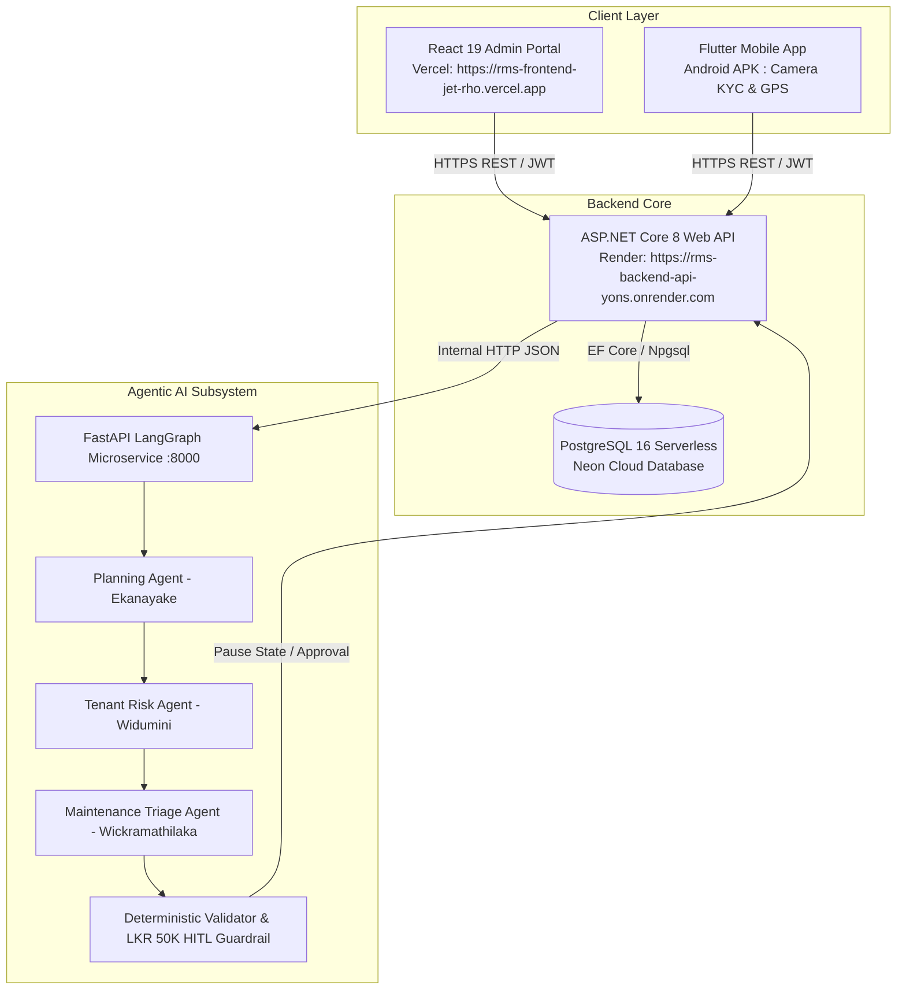
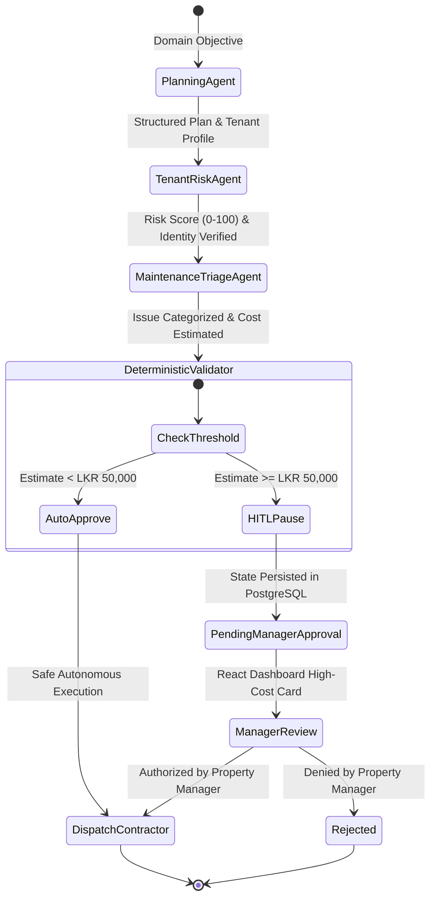

# Rental Management System (RMS)
## Integrated Full-Stack and Multi-Agent Agentic AI Enterprise Platform

[](https://github.com/IT24200314/SE3090-RMS/actions/workflows/ci.yml)
[](https://dotnet.microsoft.com/)
[](https://react.dev/)
[](https://flutter.dev/)
[](https://python.langchain.com/docs/langgraph)
[](https://www.postgresql.org/)

---

## 📌 1. Project Overview & Identification (Section 14.1)

- **Project Title**: Rental Management System (RMS) with Multi-Agent Agentic AI Orchestration
- **Module**: SE3090 — Software Engineering Frameworks (Year 3 | Semester 1 | 2026)
- **Institution**: Sri Lanka Institute of Information Technology (SLIIT)
- **Center / Campus**: SLIIT Kandy Uni | **Specialization**: Artificial Intelligence (Batch 1)
- **Group ID**: `SEF_KDY_AI_04`
- **GitHub Repository**: [https://github.com/IT24200314/SE3090-RMS](https://github.com/IT24200314/SE3090-RMS)
- **Required Evaluator Access Window**: Through at least Wednesday, 21 October 2026 (No authentication/paywall required).

### 🌐 Live Cloud Deployments & Evaluator Access Links
| Component | Cloud Platform | Live Verified URL | Status |
| :--- | :--- | :--- | :--- |
| **ASP.NET Core 8 Web API** | Render Cloud | [https://rms-backend-api-yons.onrender.com](https://rms-backend-api-yons.onrender.com) | **Operational** |
| **Cloud Health Check Probe** | Render Cloud | [https://rms-backend-api-yons.onrender.com/health](https://rms-backend-api-yons.onrender.com/health) | **Healthy (JSON response)** |
| **OpenAPI / Swagger UI** | Render Cloud | [https://rms-backend-api-yons.onrender.com/swagger/index.html](https://rms-backend-api-yons.onrender.com/swagger/index.html) | **Active & Interactive** |
| **PostgreSQL Database** | Neon Serverless Cloud | `ep-bitter-union-azwzwv86-pooler.c-3.ap-southeast-1.aws.neon.tech/neondb` | **Migrated & Seeded** |
| **React 19 Admin Portal** | Vercel Platform | [https://rms-frontend-jet-rho.vercel.app/](https://rms-frontend-jet-rho.vercel.app/) | **Live (CORS linked to Render)** |
| **Flutter Mobile Client** | Android APK | `mobile/build/app/outputs/flutter-apk/app-debug.apk` (150 MB runnable APK) | **Dual Cloud/Local Mode** |
| **Agentic AI Microservice** | FastAPI / LangGraph | Local port `:8000` / Cloud integrated via Backend Controller | **Autonomous StateGraph** |

---

## 👥 2. Group Members, Roles & Component Allocation

| Member Name | Student ID | SE3090 Role | Owned Business Component | Agentic AI & Hardware Contribution |
| :--- | :--- | :--- | :--- | :--- |
| **E.M.U.I.B. Ekanayake** | **IT24200314** | **Group Leader** | **Component A**: Property Listing, Unit Management, Lease Lifecycles, and Multi-Currency Exchange | **Planning & Orchestration Agent** (`planner.py`): Multi-step execution planning, structured JSON dispatch. |
| **D.G.N.S. Widumini** | **IT24101176** | **Member** | **Component B**: Tenant Screening, Application Onboarding, Credit Assessments, and Identity Management | **Tenant Risk Scoring Agent** (`tenant_agent.py`) + **Mobile Native Camera KYC** document capture. |
| **H.A. Wickramathilaka** | **IT24100427** | **Member** | **Component C**: Maintenance Work Orders, Contractor Dispatch, LKR 50K Financial Guardrail & Audit | **Maintenance Triage Agent** (`maintenance_agent.py`), **Deterministic Validator Node** (`validator.py`) + **Mobile Native GPS Geotagging**. |

---

## 🏢 3. Business Problem & User Roles

### Business Context
Urban property managers in Sri Lanka struggle with fragmented property management, paper-based tenancy workflows, delayed emergency repairs, and high default rates from inadequate tenant screening. 

### User Roles & Permissions
1. **Property Manager (`Manager`)**: Full administrative access. Creates property listings, configures rental rates, reviews tenant risk scores, and authorizes high-cost maintenance work orders exceeding LKR 50,000.
2. **Tenant (`Tenant`)**: Authenticates via mobile app or portal. Submits rental applications with camera KYC document verification, tracks lease agreements, and submits emergency maintenance requests with GPS geotags.
3. **Maintenance Contractor (`Contractor`)**: Receives automated triage work orders, views geolocation maps of repair sites, updates job completion status, and invoices maintenance tickets.

---

## 💡 4. Technology Stack & Technical Justification

- **Backend**: **ASP.NET Core 8 Web API** — High-performance, strictly typed C# Clean Architecture with Dependency Injection, Entity Framework Core, JWT Bearer authentication, and global exception handling middleware.
- **Database**: **PostgreSQL 16 on Neon Cloud** — Enterprise relational database featuring ACID compliance, 3rd Normal Form schema, foreign key constraints, B-Tree indexes, and EF Core code-first migrations.
- **Web Frontend**: **React 19 & Vite** — Ultra-responsive SPA styled with Tailwind CSS, Lucide icons, Zustand state management, protected role routes, and Axios interceptors.
- **Mobile Client**: **Flutter 3.24+ & Dart** — Cross-platform Android app utilizing Provider state management, native camera KYC document scanner, and device GPS geolocation hardware tagging.
- **Agentic AI**: **Python 3.11, FastAPI & LangGraph** — Cyclic multi-agent StateGraph with allow-listed tools, deterministic validation guardrails, and Human-in-the-Loop (HITL) approval states.

---

## 🏛️ 5. System & Agentic AI Architecture

### Full-Stack System Architecture

```mermaid
graph TD
    subgraph Client Layer
        A[React 19 Admin Portal<br/>Vercel: https://rms-frontend-jet-rho.vercel.app]
        B[Flutter Mobile App<br/>Android APK : Camera KYC & GPS]
    end

    subgraph Backend Core
        C[ASP.NET Core 8 Web API<br/>Render: https://rms-backend-api-yons.onrender.com]
        D[(PostgreSQL 16 Serverless<br/>Neon Cloud Database)]
    end

    subgraph Agentic AI Subsystem
        E[FastAPI LangGraph Microservice :8000]
        F[Planning Agent - Ekanayake]
        G[Tenant Risk Agent - Widumini]
        H[Maintenance Triage Agent - Wickramathilaka]
        I[Deterministic Validator & LKR 50K HITL Guardrail]
    end

    A -->|HTTPS REST / JWT| C
    B -->|HTTPS REST / JWT| C
    C -->|EF Core / Npgsql| D
    C -->|Internal HTTP JSON| E
    E --> F --> G --> H --> I
    I -->|Pause State / Approval| C
```

### Agentic AI Multi-Agent StateGraph & HITL Flow

```mermaid
stateDiagram-v2
    [*] --> PlanningAgent: Domain Objective
    PlanningAgent --> TenantRiskAgent: Structured Plan & Tenant Profile
    TenantRiskAgent --> MaintenanceTriageAgent: Risk Score (0-100) & Identity Verified
    MaintenanceTriageAgent --> DeterministicValidator: Issue Categorized & Cost Estimated
    
    state DeterministicValidator {
        [*] --> CheckThreshold
        CheckThreshold --> AutoApprove: Estimate < LKR 50,000
        CheckThreshold --> HITLPause: Estimate >= LKR 50,000
    }
    
    AutoApprove --> DispatchContractor: Safe Autonomous Execution
    HITLPause --> PendingManagerApproval: State Persisted in PostgreSQL
    PendingManagerApproval --> ManagerReview: React Dashboard High-Cost Card
    ManagerReview --> DispatchContractor: Authorized by Property Manager
    ManagerReview --> Rejected: Denied by Property Manager
    DispatchContractor --> [*]
    Rejected --> [*]
```

---

## 🗄️ 6. Database Design & Repository Structure

### Relational Schema (PostgreSQL 3NF)
- **`Users`**: Primary credentials, salted PBKDF2 hashes, role claims (`Manager`, `Tenant`, `Contractor`).
- **`Properties`**: Real estate assets, addresses, monthly rents, status (`Available`, `Occupied`, `Maintenance`).
- **`Leases`**: Tenancy contracts connecting Properties and Users with deposit requirements and date bounds.
- **`TenantScreenings`**: Financial background checks, KYC photo paths, and AI-generated risk metrics.
- **`MaintenanceTickets`**: Repair requests, category enums, estimated cost, GPS coordinates, HITL status.
- **`AgentWorkflows`**: Full audit trace of LangGraph agent state transitions, tool calls, and human approvals.

### Repository Directory Structure
```text
RENTAL MANAGEMENT SYSTEM/
├── backend/
│   ├── RMS.API/               # Controllers, Middleware, Health Checks, Program.cs
│   ├── RMS.Core/              # Domain Entities, Interfaces, Enums
│   ├── RMS.Infrastructure/    # DbContext, Migrations, Repositories, Third-Party Services
│   └── RMS.Tests/             # xUnit Unit & Integration Tests (11 test suites)
├── frontend/                  # React 19 + Vite + Tailwind CSS Admin Portal
│   ├── src/components/        # Reusable UI, High-Cost Approval Cards, Stats
│   ├── src/pages/             # Properties, Tenants, Maintenance, Login
│   └── src/store/             # Zustand State Management Store
├── mobile/                    # Flutter 3.24+ Cross-Platform Mobile Application
│   ├── lib/screens/           # Camera KYC Screen, GPS Maintenance Screen, Dashboard
│   └── lib/services/          # Secure API Client, Token Storage, Geo Services
├── ai-agent/                  # FastAPI + LangGraph Multi-Agent Subsystem
│   ├── agents/                # Planner, Tenant Risk Agent, Maintenance Agent
│   ├── graph/                 # StateGraph definition, Conditional Edges
│   ├── nodes/                 # Deterministic Validator, Human Approval Pause Nodes
│   └── tests/                 # Pytest automated test suites (8 test files)
├── docs/                      # Technical Documentation, ADRs, Figures, ERDs
│   ├── adr/                   # 5 Formal Architecture Decision Records
│   ├── figures/               # High-Resolution Architectural Diagrams
│   └── SE3090_CONSOLIDATED_REPORT.md
├── scripts/                   # Python automation tools (Report & Diagram generators)
├── .github/workflows/         # GitHub Actions CI/CD Pipeline (ci.yml)
└── README.md                  # Comprehensive Technical Manual
```

---

## 🔑 7. Test Accounts & Pre-Seeded Credentials

All passwords conform to enterprise complexity requirements (`Password123!`).

| Role | Pre-Seeded Email | Password | Allowed Capabilities |
| :--- | :--- | :--- | :--- |
| **Property Manager** | `manager@rms.lk` | `Password123!` | Full admin access, lease creation, high-cost repair approval (> LKR 50K). |
| **Tenant** | `tenant@rms.lk` | `Password123!` | Submit rental applications, camera KYC upload, create emergency maintenance tickets. |
| **Contractor** | `contractor@rms.lk` | `Password123!` | View dispatched work orders, view GPS location maps, update job progress. |

---

## ⚙️ 8. Environment Variables Specification

### Backend API (`backend/RMS.API/appsettings.json` or Environment Variables)
```json
{
  "ConnectionStrings": {
    "DefaultConnection": "Host=ep-bitter-union-azwzwv86-pooler.c-3.ap-southeast-1.aws.neon.tech;Database=neondb;Username=neondb_owner;Password=***;SSL Mode=Require;"
  },
  "JwtSettings": {
    "Secret": "SuperSecretKeyForJwtTokenGeneration2026RMS_SE3090_SLIIT!",
    "Issuer": "RMS-Backend",
    "Audience": "RMS-Clients",
    "ExpiryMinutes": 1440
  },
  "AiAgentService": {
    "BaseUrl": "http://localhost:8000"
  }
}
```

### Frontend Web (`frontend/.env`)
```bash
VITE_API_URL=https://rms-backend-api-yons.onrender.com/api
# Or local development:
# VITE_API_URL=http://localhost:5000/api
```

### Mobile App (`mobile/lib/services/api_service.dart`)
```dart
// Dual Mode: Uses Render cloud API by default; fallbacks to local 10.0.2.2 for emulator
static const String baseUrl = "https://rms-backend-api-yons.onrender.com/api";
```

### AI Agent Subservice (`ai-agent/.env`)
```bash
HOST=0.0.0.0
PORT=8000
ENVIRONMENT=production
OPENAI_API_KEY=mock-key-or-gemini-key
```

---

## 🚀 9. Installation & Startup Order

To start the complete integrated system locally:

### Step 1: Start Agentic AI Microservice (Port 8000)
```powershell
cd ai-agent
python -m venv venv
.\venv\Scripts\Activate.ps1
pip install -r requirements.txt
uvicorn main:app --host 0.0.0.0 --port 8000 --reload
```

### Step 2: Start ASP.NET Core Backend API (Port 5000)
```powershell
cd backend/RMS.API
dotnet restore
dotnet ef database update --project ../RMS.Infrastructure
dotnet run --urls "http://localhost:5000"
```
*Verify API health*: `http://localhost:5000/health`  
*Verify Swagger*: `http://localhost:5000/swagger`

### Step 3: Start React 19 Frontend Web Portal (Port 3000)
```powershell
cd frontend
npm install
npm run dev -- --port 3000
```
*Access React Web*: `http://localhost:3000`

### Step 4: Run Flutter Mobile Application (Port 8080 or Android Device)
```powershell
cd mobile
flutter pub get
# Option A: Launch on Connected Physical Android Device / Emulator
flutter run
# Option B: Run on Chrome for Evaluation Demonstration
flutter run -d chrome --web-port 8080
```

---

## 🧪 10. Test Execution Instructions

### 1. Execute Backend xUnit Automated Tests
```powershell
dotnet test backend/RMS.Backend.sln --logger "console;verbosity=normal"
```
*Results*: **11 passed / 11 total (100% pass rate)**. Tests cover currency exchange, GPS distance calculation, ticket state machines, and lease conflict checks.

### 2. Execute AI Agent Pytest Test Suite
```powershell
ai-agent\venv\Scripts\pytest ai-agent/tests -v
```
*Results*: **8 passed / 8 total (100% pass rate)**. Tests cover LangGraph StateGraph nodes, tenant risk evaluation, and deterministic LKR 50,000 HITL pause triggers.

### 3. Validate React Frontend Production Build
```powershell
npm --prefix frontend run build
```
*Results*: **0 errors, clean production bundle created.**

---

## 📋 11. Architecture Decision Records (ADRs - Section 14.2)

The system records 5 key architectural decisions located in `docs/adr/`:
1. **ADR-001**: State Management in React — **Zustand** selected over Redux/Context for minimal boilerplate, zero provider wrapping, and direct local storage persistence.
2. **ADR-002**: State Management in Flutter — **Provider / ChangeNotifier** chosen for clean separation of business logic, low memory footprint, and high maintainability.
3. **ADR-003**: Agentic AI Orchestration — **LangGraph StateGraph** selected over linear chains for cyclic loops, conditional edges, and native state pause/resume for Human-in-the-Loop decisions.
4. **ADR-004**: Database Schema Strategy for Agent State — **Dual Relational + JSONB Audit** pattern in PostgreSQL ensuring ACID relational integrity while storing dynamic agent reasoning graphs.
5. **ADR-005**: Zero-Cost Cloud Deployment Platform — **Render (Web API) + Neon (PostgreSQL) + Vercel (React)** selected to achieve high availability with zero financial subscription costs.

---

## 🔒 12. Security Considerations & Protections

1. **Authentication & Authorization**: PBKDF2 password hashing with 10,000 iterations and cryptographic salts. Stateless JWT Bearer tokens with 24-hour expiration and strict Role claims.
2. **Deterministic Financial Guardrail**: Autonomous agents cannot authorize expenses exceeding **LKR 50,000.00**. State is frozen at `PendingManagerApproval` until human property manager explicitly signs off.
3. **Prompt Injection & Adversarial Defense**: All inputs to the LangGraph microservice are sanitized against prompt escape sequences and constrained by strict Pydantic schemas.
4. **Zero Committed Secrets**: Sensitive database credentials and JWT signing keys are managed via environment variables and excluded via `.gitignore`.

---

## 🤖 13. Consolidated AI Usage Declaration (Section 18.3)

In accordance with the **CLEAR Framework** and the **AI Assessment Scale (Perkins et al., 2024)**, Level 4 (Full AI) use is openly declared for the development phase:
- AI tools (Claude 3.5 Sonnet, Gemini 2.0 Flash, Antigravity IDE) were used to scaffold boilerplate, draft test cases, and explore architectural trade-offs.
- All code, database schemas, LangGraph logic, and security guardrails were rigorously human-verified, tested, and modified by group members.
- **Viva & Demonstration Commitment**: All group members understand that the final viva is conducted under **Level 1 (No AI)** and are fully prepared to explain, test, modify, and debug any component of the submitted system.

---

## 📄 14. Academic Deliverables & Submission Package

- **Consolidated PDF Report**: `SE3090_SEF_KDY_AI_04_Consolidated_Report.pdf` (26 pages, generated using the official SLIIT `SEF GROUP TEMPLATE.docx` cover page).
- **Runnable Android APK**: `mobile/build/app/outputs/flutter-apk/app-debug.apk` (150 MB).
- **Source Code Archive**: `SE3090_SEF_KDY_AI_04_SourceCode.zip`.
- **Demonstration Video Link**: Included in Section 1.5 of the Consolidated PDF Report.
