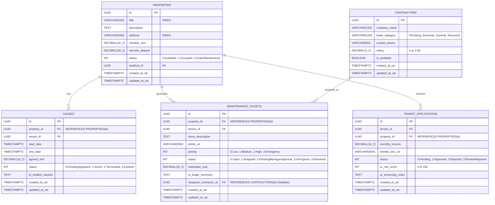

# Rental Management System (RMS) - Relational Database Schema & ERD

## 1. Entity-Relationship Diagram (ERD)

---

## 2. Table Schemas, Constraints & Indexes

### A. `Properties` Table
- **Primary Key**: `id` (UUID, Default `gen_random_uuid()`)
- **Indexes**:
  - `idx_properties_status` on `status` (B-Tree)
  - `idx_properties_title` on `title` (Trigram / B-Tree for search)
  - `idx_properties_address` on `address` (B-Tree)
- **Audit Columns**: `created_at_utc` (NOT NULL), `updated_at_utc` (NULL)

### B. `Leases` Table
- **Primary Key**: `id` (UUID)
- **Foreign Keys**:
  - `property_id` $\rightarrow$ `Properties(id)` ON DELETE RESTRICT
- **Check Constraints**: `CHECK (end_date > start_date)`, `CHECK (agreed_rent > 0)`
- **Indexes**: `idx_leases_property_id`, `idx_leases_status`

### C. `TenantApplications` Table
- **Primary Key**: `id` (UUID)
- **Foreign Keys**: `property_id` $\rightarrow$ `Properties(id)` ON DELETE CASCADE
- **Check Constraints**: `CHECK (monthly_income >= 0)`, `CHECK (ai_risk_score BETWEEN 0 AND 100)`
- **Indexes**: `idx_applications_status`, `idx_applications_risk_score`

### D. `MaintenanceTickets` Table
- **Primary Key**: `id` (UUID)
- **Foreign Keys**:
  - `property_id` $\rightarrow$ `Properties(id)` ON DELETE CASCADE
  - `assigned_contractor_id` $\rightarrow$ `Contractors(id)` ON DELETE SET NULL
- **Check Constraints**: `CHECK (estimated_cost >= 0)`
- **Business Safeguard**: Any row with `estimated_cost >= 50000.00` is paused at `status = 2 (PendingManagerApproval)`.
