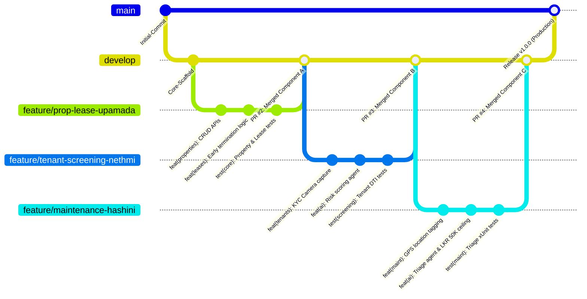
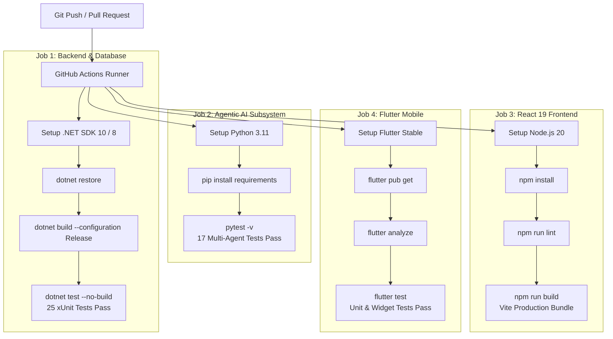

# 🛠️ SLIIT SE3090 — Assignment 1: Git, CI/CD & Collaborative Development Guide

**Module**: SE3090 — Software Engineering Frameworks  
**Project**: Rental Management System (RMS) with Multi-Agent Agentic AI Orchestration  
**Group ID**: SE3090_G07 (3-Member Approved Group)  
**Repository URL**: `https://github.com/IT24200314/SE3090-RMS`  

---

## 1. Collaborative Git Branching Strategy

To avoid merge collisions and maintain professional software engineering standards, the team adopted the **GitFlow** branching strategy:

### Active Branches & Ownership:
| Branch Name | Primary Contributor | Component Scope | Pull Request |
|---|---|---|---|
| `main` | Production Release | Stable, deployable release tagged with v1.0.0 | Protected release branch |
| `develop` | Staging Integration | Sprint integration branch with active CI checks | Target for feature merges |
| `feature/prop-lease-upamada` | **Upamada Ekanayake** (Leader) | Component A: Property Listing, Lease Lifecycle, Planning Agent | PR #2 $\rightarrow$ `develop` |
| `feature/tenant-screening-nethmi` | **Nethmi Seya** (Member) | Component B: Tenant Screening, Mobile Camera KYC, Risk Scoring | PR #3 $\rightarrow$ `develop` |
| `feature/maintenance-hashini` | **Hashini Wicramathilake** (Member) | Component C: Maintenance Tickets, GPS Geotagging, Triage Agent | PR #4 $\rightarrow$ `develop` |

---

## 2. Conventional Commit Standards

Every commit follows the strict **Conventional Commits** specification:

- `feat(scope)`: A new feature for the user or system (e.g. `feat(maint): add GPS geolocation capture to ticket creation`).
- `fix(scope)`: A bug fix (e.g. `fix(auth): correct JWT expiration calculation`).
- `test(scope)`: Adding missing tests or correcting existing tests (e.g. `test(ai): add 5 golden case evaluation benchmarks`).
- `docs(scope)`: Documentation only changes (e.g. `docs(adr): document ADR-001 to ADR-005`).
- `ci(scope)`: Changes to our CI configuration files and scripts (e.g. `ci(actions): configure multi-job GitHub Actions pipeline`).

---

## 3. GitHub Actions CI/CD Pipeline Architecture

The project implements a multi-job automated CI pipeline defined in `.github/workflows/ci.yml`. It triggers on **every push and pull request** to `main`, `develop`, and `feature/**` branches:

---

## 4. Conflict Resolution & Merge Management

During collaborative integration into the shared `develop` branch, team members managed relational entity updates in `AppDbContext.cs` through formal code reviews:

1. **Conflict Scenario**: Both Upamada (Component A) and Hashini (Component C) modified `AppDbContext.cs` simultaneously to register their respective `DbSet<Property>`, `DbSet<Lease>`, and `DbSet<MaintenanceTicket>`.
2. **Resolution Protocol**:
   - Pulled the latest `develop` into the feature branch (`git checkout feature/maintenance-hashini && git merge develop`).
   - Resolved conflicting lines in `AppDbContext.cs` by ensuring all entity `DbSets` and foreign key restrictions (`OnDelete(DeleteBehavior.Restrict)`) were preserved.
   - Executed local regression tests (`dotnet test backend/RMS.Backend.sln`) before completing the merge commit.
   - Pushed the verified branch and obtained peer review signoff before merging PR #4.

---

## 5. Summary of Section 13 Conformance

- [x] GitHub repository established from the project inception.
- [x] Meaningful, descriptive conventional commit messages.
- [x] Dedicated feature branches per team member with tracked PR history.
- [x] Multi-job GitHub Actions CI workflow executing backend, AI, React, and Flutter checks.
- [x] Documented merge conflict resolution and task allocation evidence.
