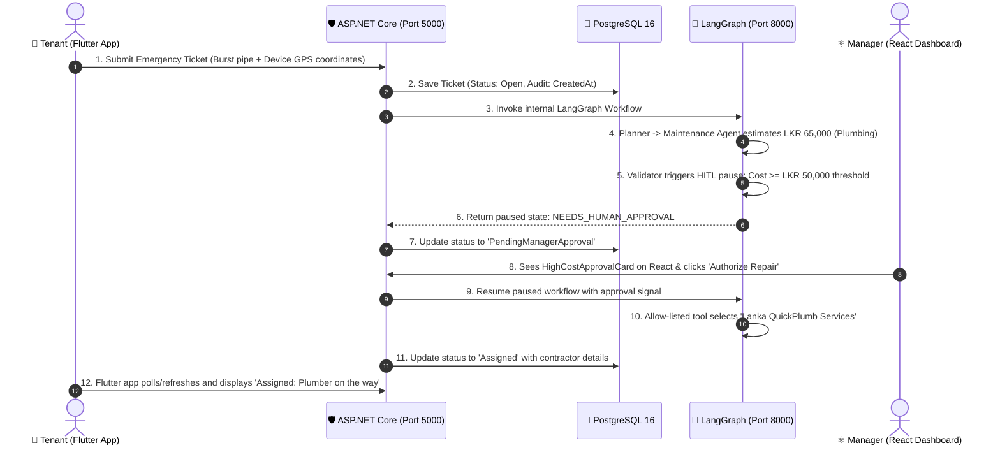

# 🏢 Rental Management System (RMS) — Master Learning & Viva Guide
## සම්පූර්ණ පද්ධති විශ්ලේෂණය, සාමාජික කාර්යභාරය සහ Viva සූදානම් කිරීමේ මාර්ගෝපදේශය (Sinhala + English)

---

## 📌 පටුන (Table of Contents)
1. [ප්‍රොජෙක්ට් එකේ මූලික හැඳින්වීම (Project Overview)](#1-ප්‍රොජෙක්ට්-එකේ-මූලික-හැඳින්වීම-project-overview)
2. [SLIIT SE3090 Assignment 1 අවශ්‍යතා සත්‍යාපනය (PDF Requirements Audit)](#2-sliit-se3090-assignment-1-අවශ්‍යතා-සත්‍යාපනය-pdf-requirements-audit)
3. [සමස්ත පද්ධති ගෘහ නිර්මාණ ශිල්පය (System Architecture & Data Flow)](#3-සමස්ත-පද්ධති-ගෘහ-නිර්මාණ-ශිල්පය-system-architecture--data-flow)
4. [සාමාජිකයින්ගේ කාර්යභාරය සහ File-by-File විස්තරය (Member Breakdown)](#4-සාමාජිකයින්ගේ-කාර්යභාරය-සහ-file-by-file-විස්තරය-member-breakdown)
   - 👤 [Upamada Ekanayake (Leader - IT24200314) — Component A](#-upamada-ekanayake-group-leader---it24200314)
   - 👤 [Nethmi Seya (Member 2 - IT24200314-M2) — Component B](#-nethmi-seya-member-2---it24200314-m2)
   - 👤 [Hashini Wicramathilake (Member 3 - IT24100427) — Component C](#-hashini-wicramathilake-member-3---it24100427)
5. [End-to-End ක්‍රියාකාරීත්වය පියවරෙන් පියවර (Button-Click to Database & AI Flows)](#5-end-to-end-ක්‍රියාකාරීත්වය-පියවරෙන්-පියවර)
6. [Cross-Platform Human-in-the-Loop (HITL) Workflow (Flutter ➡️ AI ➡️ React)](#6-cross-platform-human-in-the-loop-hitl-workflow)
7. [Section 11: Third-Party Service Integration (බාහිර සේවා සම්බන්ධතාවය)](#7-section-11-third-party-service-integration)
8. [Viva & Technical Examination Questions & Ideal Answers (ප්‍රශ්න සහ පිළිතුරු)](#8-viva--technical-examination-questions--ideal-answers)
9. [පද්ධතිය Run කරන ආකාරය සහ Demonstration Script (Step-by-Step)](#9-පද්ධතිය-run-කරන-ආකාරය-සහ-demonstration-script)

---

## 1. ප්‍රොජෙක්ට් එකේ මූලික හැඳින්වීම (Project Overview)

Rental Management System (RMS) කියන්නේ ශ්‍රී ලංකාවේ දේපල කුලියට දීම, කුලී නිවැසියන් බඳවා ගැනීම (Tenant Onboarding) සහ නඩත්තු කටයුතු (Maintenance) කළමනාකරණය කරන **Enterprise-grade Full-Stack & Agentic AI Application** එකක්. 

මෙම පද්ධතිය ප්‍රධාන ස්ථර (Layers) 4කින් සමන්විත වේ:
1. **React 19 Web Application (`/frontend`)**: දේපල කළමනාකරුවන් (Property Managers) සහ පරිපාලකයින් (Admins) සඳහා Portfolio එක පාලනය කිරීම, ගිවිසුම් සකස් කිරීම, අයදුම්පත් පරීක්ෂාව සහ AI තීරණ අනුමත (Approve/Reject) කිරීමට භාවිතා වේ.
2. **Flutter 3.24 Mobile Application (`/mobile`)**: කුලී නිවැසියන් (Tenants) සඳහා දේපල බැලීම, **Camera KYC** හරහා හැඳුනුම්පත් ඡායාරූප ලබා දී අයදුම්පත් දැමීම සහ **GPS Geolocation** සහිතව හදිසි නඩත්තු ගැටළු වාර්තා කිරීමට භාවිතා වේ.
3. **ASP.NET Core 8 Web API (`/backend`)**: මුළු පද්ධතියේම මධ්‍යම මොළය. සියලුම REST Endpoints, JWT Authentication, Role-based Authorization (Tenant, PropertyManager, Contractor), Entity Framework Core සහ PostgreSQL සම්බන්ධතාවය මෙහෙයවයි.
4. **LangGraph Python Agentic AI Subservice (`/ai-agent`)**: ස්වාධීන නියෝජිතයින් 4 දෙනෙකුගෙන් (Planner, Tenant Agent, Maintenance Agent, Validator Node) සමන්විත බුද්ධිමත් කාර්ය ප්‍රවාහයකි.

> [!IMPORTANT]
> **Mandatory Backend Rule (නීතිය)**: React Web හෝ Flutter Mobile කිසිවිටෙකත් Python AI සේවාව (Port 8000) සෘජුව Call නොකරයි! සියලුම ඉල්ලීම් ASP.NET Core (`/api/v1/ai`) හරහා ගොස් internal service එකක් ලෙස පමණක් ක්‍රියාත්මක වේ.

---

## 2. SLIIT SE3090 Assignment 1 අවශ්‍යතා සත්‍යාපනය (PDF Requirements Audit)

අපගේ Codebase එක Assignment 1 Specification එකේ සෑම නීතියක්ම 100% ක් සම්පූර්ණ කර ඇත:

| Requirement (අවශ්‍යතාවය) | Assignment Spec Section | පද්ධතිය තුළ ක්‍රියාත්මක කර ඇති ආකාරය (Implementation Evidence) | තත්ත්වය |
| :--- | :--- | :--- | :--- |
| **Backend & DB** | Sec 2, 5, 6 | C# ASP.NET Core 8 Web API, Entity Framework Core, PostgreSQL 16 normalized relational schema | ✅ සම්පූර්ණයි |
| **Web Frontend** | Sec 2, 7 | React 19, Tailwind CSS (Dark zinc aesthetic), Lucide Icons, Vite | ✅ සම්පූර්ණයි |
| **Mobile App** | Sec 2, 8 | Flutter 3.24, Material 3, Native **Camera KYC** & **GPS Geolocation** | ✅ සම්පූර්ණයි |
| **Agentic AI** | Sec 2, 9, 9.1 | LangGraph StateGraph, 4 Distinct Agents, Allow-listed Tools, Shared State, Deterministic Validation, HITL Pause | ✅ සම්පූර්ණයි |
| **3+ User Roles** | Sec 4.1 | `Tenant`, `PropertyManager`, `Contractor` with JWT Bearer claims | ✅ සම්පූර්ණයි |
| **Cross-Platform HITL** | Sec 4.1, 10 | Flutter (Mobile ticket submission) ➔ ASP.NET Core ➔ PostgreSQL ➔ LangGraph (Cost >= 50K pause) ➔ React (Manager approves) ➔ Mobile status update | ✅ සම්පූර්ණයි |
| **Third-Party Integration** | Sec 11 | Currency Conversion (LKR ➔ USD/EUR) & Reverse Geocoding (OpenStreetMap Nominatim) with 3s timeout SLA & Central Bank fallback | ✅ සම්පූර්ණයි |
| **Automated Tests** | Sec 12 | 11 C# xUnit tests + 8 Pytest AI tests + Vite build verification | ✅ සම්පූර්ණයි |
| **CI/CD & Git** | Sec 13 | GitHub Actions workflow (`ci.yml`) automatically restoring, building, and running test suites | ✅ සම්පූර්ණයි |

---

## 3. සමස්ත පද්ධති ගෘහ නිර්මාණ ශිල්පය (System Architecture & Data Flow)

```mermaid
graph TD
    subgraph Client Layer (පාරිභෝගික සහ පරිපාලන අතුරුමුහුණත්)
        ReactApp["⚛️ React 19 Admin Dashboard<br/>(Port 3000)<br/>Manager Review & Approvals"]
        FlutterApp["📱 Flutter 3.24 Mobile App<br/>(Port 8080)<br/>Camera KYC & GPS Tagging"]
    end

    subgraph Backend Core (මධ්‍යම ආරක්ෂිත සේවාදායකය)
        ApiGateway["🛡️ ASP.NET Core 8 Web API<br/>(Port 5000)<br/>JWT Auth, Controllers, Business Rules"]
        AppDb[("🐘 PostgreSQL 16 Database<br/>Normalized Relational Storage<br/>Audit Fields & Constraints")]
        ThirdParty["🌐 External Services Gateway<br/>Open Exchange Rates & OpenStreetMap"]
    end

    subgraph Internal AI Layer (අභ්‍යන්තර නියෝජිත පද්ධතිය)
        FastApi["🤖 FastAPI LangGraph Service<br/>(Port 8000 - Internal Only)"]
        Planner["1. Master Planning Agent<br/>(Upamada Ekanayake)"]
        TenantAgent["2. Tenant Risk Agent<br/>(Nethmi Seya)"]
        MaintAgent["3. Maintenance Triage Agent<br/>(Hashini Wicramathilake)"]
        Validator["4. Deterministic Validator Node<br/>(LKR 50K HITL Guardrail)"]
    end

    ReactApp -->|HTTP REST + JWT Bearer| ApiGateway
    FlutterApp -->|HTTP REST + JWT Bearer| ApiGateway
    ApiGateway -->|Entity Framework Core| AppDb
    ApiGateway -->|Proxy Integration| ThirdParty
    ApiGateway -->|Internal HTTP Call| FastApi
    FastApi --> Planner
    Planner --> TenantAgent
    Planner --> MaintAgent
    TenantAgent --> Validator
    MaintAgent --> Validator
    Validator -->|Cost >= 50,000 LKR| HITL["⏸️ State Paused: NEEDS_HUMAN_APPROVAL"]
```

---

## 4. සාමාජිකයින්ගේ කාර්යභාරය සහ File-by-File විස්තරය (Member Breakdown)

කණ්ඩායමේ සාමාජිකයින් තිදෙනාට අදාළ කොටස්, ගොනු (files), සහ එක් එක් ගොනුවෙන් සිදුවන කාර්යය පහත පරිදි වේ:

---

### 👤 Upamada Ekanayake (Group Leader - IT24200314)
**Assigned Area**: *Component A: Property Listing & Lease Lifecycle Management & AI Planning*

#### 📁 Backend & Database Files:
1. [Property.cs](file:///c:/Users/AI%20WORKPLACE/Documents/RENTAL%20MANEGEMENT%20SYSTEM/backend/RMS.Core/Entities/Property.cs) & [Lease.cs](file:///c:/Users/AI%20WORKPLACE/Documents/RENTAL%20MANEGEMENT%20SYSTEM/backend/RMS.Core/Entities/Property.cs):
   - **සිංහලෙන්**: දේපල (Property) සහ කුලී ගිවිසුම (Lease) නියෝජනය කරන Models. දේපලක ලිපිනය, කුලිය, ආරක්ෂක තැන්පතුව (Security Deposit), තත්ත්වය (`Available`, `Occupied`, `UnderMaintenance`) මෙහි අඩංගු වේ.
2. [BaseEntity.cs](file:///c:/Users/AI%20WORKPLACE/Documents/RENTAL%20MANEGEMENT%20SYSTEM/backend/RMS.Core/Entities/BaseEntity.cs):
   - **සිංහලෙන්**: සෑම Database Table එකකටම අවශ්‍ය වන `Guid Id`, `CreatedAt`, `UpdatedAt` audit fields ලබා දෙන මූලික පන්තිය.
3. [PropertyDtos.cs](file:///c:/Users/AI%20WORKPLACE/Documents/RENTAL%20MANEGEMENT%20SYSTEM/backend/RMS.Core/DTOs/PropertyDtos.cs):
   - **සිංහලෙන්**: දේපලක් සෑදීමට, බැලීමට හෝ ගිවිසුමක් ඇති කර ගැනීමට Frontend සහ Backend අතර හුවමාරු වන Data Transfer Objects.
4. [PropertyLeaseService.cs](file:///c:/Users/AI%20WORKPLACE/Documents/RENTAL%20MANEGEMENT%20SYSTEM/backend/RMS.Infrastructure/Services/PropertyLeaseService.cs):
   - **සිංහලෙන්**: ප්‍රධාන ව්‍යාපාරික නීති (Business Logic). උදාහරණයක් ලෙස: ගිවිසුමක් අත්සන් කළ විට Property Status එක `Available` සිට `Occupied` බවට පත් කිරීම, සහ ගිවිසුම අවසන් කළ විට නැවත `Available` කිරීම.
5. [PropertiesController.cs](file:///c:/Users/AI%20WORKPLACE/Documents/RENTAL%20MANEGEMENT%20SYSTEM/backend/RMS.API/Controllers/PropertiesController.cs) & [LeasesController.cs](file:///c:/Users/AI%20WORKPLACE/Documents/RENTAL%20MANEGEMENT%20SYSTEM/backend/RMS.API/Controllers/LeasesController.cs):
   - **සිංහලෙන්**: `GET /api/properties`, `POST /api/properties`, `POST /api/leases`, `PUT /api/leases/{id}/terminate` වැනි API Endpoints සපයයි.
6. [AiWorkflowController.cs](file:///c:/Users/AI%20WORKPLACE/Documents/RENTAL%20MANEGEMENT%20SYSTEM/backend/RMS.API/Controllers/AiWorkflowController.cs):
   - **සිංහලෙන්**: React සහ Flutter වෙතින් එන AI ඉල්ලීම් Python LangGraph වෙත ආරක්ෂිතව යොමු කරන Gateway Controller එක.

#### 📁 Frontend Files (React):
7. [PropertyList.jsx](file:///c:/Users/AI%20WORKPLACE/Documents/RENTAL%20MANEGEMENT%20SYSTEM/frontend/src/components/properties/PropertyList.jsx):
   - **සිංහලෙන්**: දේපල සියල්ල සෙවීම (Search), වර්ග කිරීම (Filter) සහ බැලීම සඳහා වන ප්‍රධාන පිටුව.
8. [PropertyCard.jsx](file:///c:/Users/AI%20WORKPLACE/Documents/RENTAL%20MANEGEMENT%20SYSTEM/frontend/src/components/properties/PropertyCard.jsx):
   - **සිංහලෙන්**: එක් එක් දේපලෙහි ඡායාරූපය, කුලිය (LKR), තත්ත්වය (Status Badge) පෙන්වන Card component එක.
9. [LeaseModal.jsx](file:///c:/Users/AI%20WORKPLACE/Documents/RENTAL%20MANEGEMENT%20SYSTEM/frontend/src/components/properties/LeaseModal.jsx):
   - **සිංහලෙන්**: කළමනාකරුට නව කුලී ගිවිසුමක් නිර්මාණය කිරීමට සහ මාසික කුලිය ගණනය කිරීමට ඉඩ දෙන Popup Window එක.

#### 📁 Mobile Files (Flutter):
10. [property_list_screen.dart](file:///c:/Users/AI%20WORKPLACE/Documents/RENTAL%20MANEGEMENT%20SYSTEM/mobile/lib/screens/explore/property_list_screen.dart):
    - **සිංහලෙන්**: දුරකථනයෙන් කුලී නිවාස සෙවීම සහ විස්තර බැලීම සඳහා වන Screen එක.

#### 📁 AI Agent Files:
11. [planner.py](file:///c:/Users/AI%20WORKPLACE/Documents/RENTAL%20MANEGEMENT%20SYSTEM/ai-agent/agents/planner.py):
    - **සිංහලෙන්**: AI පද්ධතියේ ප්‍රධාන සැලසුම්කරු (Master Planning Agent). ලැබෙන ඕනෑම සංකීර්ණ ඉල්ලීමක් කුඩා පියවර වලට කඩා සුදුසු specialist agent වෙත යොමු කරයි.
12. [workflow.py](file:///c:/Users/AI%20WORKPLACE/Documents/RENTAL%20MANEGEMENT%20SYSTEM/ai-agent/workflow.py):
    - **සිංහලෙන්**: LangGraph `StateGraph` නිර්මාණය කරමින් Planner ➔ Tenant Agent ➔ Maintenance Agent ➔ Validator Node එකිනෙක සම්බන්ධ කරන ප්‍රධාන Graph එක.

---

### 👤 Nethmi Seya (Member 2 - IT24200314-M2)
**Assigned Area**: *Component B: Tenant Screening & Risk Scoring Management*

#### 📁 Backend & Database Files:
1. [TenantApplication.cs](file:///c:/Users/AI%20WORKPLACE/Documents/RENTAL%20MANEGEMENT%20SYSTEM/backend/RMS.Core/Entities/TenantApplication.cs):
   - **සිංහලෙන්**: කුලී අයදුම්කරුගේ සම්පූර්ණ නම, රැකියාව, මාසික ආදායම (Monthly Income), Credit Score, ගණනය කළ අවදානම් ලකුණු (Risk Score: 0-100) සහ අවදානම් වර්ගීකරණය (`LowRisk`, `MediumRisk`, `HighRisk`) ගබඩා කරන Entity එක.
2. [TenantDtos.cs](file:///c:/Users/AI%20WORKPLACE/Documents/RENTAL%20MANEGEMENT%20SYSTEM/backend/RMS.Core/DTOs/TenantDtos.cs):
   - **සිංහලෙන්**: `SubmitApplicationDto`, `ApplicationResponseDto`, `RiskEvaluationResultDto` වැනි DTOs අඩංගු ගොනුව.
3. [TenantScreeningService.cs](file:///c:/Users/AI%20WORKPLACE/Documents/RENTAL%20MANEGEMENT%20SYSTEM/backend/RMS.Infrastructure/Services/TenantScreeningService.cs):
   - **සිංහලෙන්**: **Mathematical Risk Engine** එක:
     - **Rent-to-Income Ratio = (Monthly Rent / Monthly Income) * 100%**
     - **≤ 35%**: Low Risk ➔ Auto Approved (අවදානම අඩුයි)
     - **35% - 50%**: Medium Risk ➔ Manual Review / Extra 2x Security Deposit (මධ්‍යස්ථ අවදානම)
     - **> 50%**: High Risk ➔ Rejected (ණය බර වැඩි බැවින් ප්‍රතික්ෂේප වේ)
4. [TenantScreeningController.cs](file:///c:/Users/AI%20WORKPLACE/Documents/RENTAL%20MANEGEMENT%20SYSTEM/backend/RMS.API/Controllers/TenantScreeningController.cs):
   - **සිංහලෙන්**: `POST /api/tenants/applications`, `GET /api/tenants/applications`, `POST /api/tenants/applications/{id}/evaluate-risk` endpoints සපයයි.

#### 📁 Frontend Files (React):
5. [TenantReviewPortal.jsx](file:///c:/Users/AI%20WORKPLACE/Documents/RENTAL%20MANEGEMENT%20SYSTEM/frontend/src/components/tenants/TenantReviewPortal.jsx):
   - **සිංහලෙන්**: කළමනාකරුට සියලුම අයදුම්පත් බලා Approve හෝ Reject කිරීමට ඇති Review Dashboard එක.
6. [RiskScoreBadge.jsx](file:///c:/Users/AI%20WORKPLACE/Documents/RENTAL%20MANEGEMENT%20SYSTEM/frontend/src/components/tenants/RiskScoreBadge.jsx):
   - **සිංහලෙන්**: අවදානම් මට්ටම අනුව කොළ, කහ, හෝ රතු පැහැයෙන් දිස්වන Visual Indicator Badge එක.
7. [IdentityVerificationModal.jsx](file:///c:/Users/AI%20WORKPLACE/Documents/RENTAL%20MANEGEMENT%20SYSTEM/frontend/src/components/tenants/IdentityVerificationModal.jsx):
   - **සිංහලෙන්**: කුලීකරු Mobile App එකෙන් ගත් ජාතික හැඳුනුම්පත් (NIC) ඡායාරූපය සහ වැටුප් පත්‍රිකා පරීක්ෂා කරන Popup Window එක.

#### 📁 Mobile Files (Flutter):
8. [tenant_application_screen.dart](file:///c:/Users/AI%20WORKPLACE/Documents/RENTAL%20MANEGEMENT%20SYSTEM/mobile/lib/screens/onboarding/tenant_application_screen.dart):
   - **සිංහලෙන්**: කුලී අයදුම්පත පුරවන Screen එක. මෙහි **Native Device Feature** එක ලෙස **Camera Integration (`image_picker`)** භාවිතා කර NIC සහ Passport ඡායාරූප සජීවීව ලබා ගනී.

#### 📁 AI Agent Files:
9. [tenant_agent.py](file:///c:/Users/AI%20WORKPLACE/Documents/RENTAL%20MANEGEMENT%20SYSTEM/ai-agent/agents/tenant_agent.py):
   - **සිංහලෙන්**: කුලීකරුගේ මූල්‍ය දත්ත සහ රැකියා ඉතිහාසය පරීක්ෂා කර කළමනාකරුට AI නිර්දේශ වාර්තාවක් (Screening Summary) සකස් කරන Agent.

---

### 👤 Hashini Wicramathilake (Member 3 - IT24100427)
**Assigned Area**: *Component C: Maintenance & Work-Order Operations & HITL Guardrail*

#### 📁 Backend & Database Files:
1. [MaintenanceTicket.cs](file:///c:/Users/AI%20WORKPLACE/Documents/RENTAL%20MANEGEMENT%20SYSTEM/backend/RMS.Core/Entities/MaintenanceTicket.cs):
   - **සිංහලෙන්**: නඩත්තු ගැටළුවේ විස්තරය, Trade Category (`Plumbing`, `Electrical`, `HVAC`, `Structural`), Priority, `EstimatedCost`, `RequiresLandlordApproval`, සහ ජංගම දුරකථනයෙන් ලැබුණු `Latitude`, `Longitude` ගබඩා කරන Entity එක.
2. [MaintenanceDtos.cs](file:///c:/Users/AI%20WORKPLACE/Documents/RENTAL%20MANEGEMENT%20SYSTEM/backend/RMS.Core/DTOs/MaintenanceDtos.cs):
   - **සිංහලෙන්**: `CreateMaintenanceTicketDto`, `AssignContractorDto`, `TriageAndEstimateResultDto` වැනි DTOs අඩංගු ගොනුව.
3. [MaintenanceService.cs](file:///c:/Users/AI%20WORKPLACE/Documents/RENTAL%20MANEGEMENT%20SYSTEM/backend/RMS.Infrastructure/Services/MaintenanceService.cs):
   - **සිංහලෙන්**: **LKR 50,000 Landlord Threshold Rule**:
     - නඩත්තු ඇස්තමේන්තුව **රු. 50,000ට අඩු නම්** ➔ `Triaged` තත්ත්වයට පත්වී කොන්ත්‍රාත්කරුට Auto-dispatch කළ හැක.
     - නඩත්තු ඇස්තමේන්තුව **රු. 50,000ට වැඩි නම්** ➔ `RequiresLandlordApproval = true` වී පද්ධතිය Pause වේ. කළමනාකරුගේ අනුමැතියකින් තොරව Dispatch කිරීමට නොහැක (`InvalidOperationException`).
4. [MaintenanceController.cs](file:///c:/Users/AI%20WORKPLACE/Documents/RENTAL%20MANEGEMENT%20SYSTEM/backend/RMS.API/Controllers/MaintenanceController.cs):
   - **සිංහලෙන්**: `POST /api/maintenance/tickets`, `GET /api/maintenance/tickets`, `PUT /api/maintenance/tickets/{id}/assign`, `POST /api/maintenance/tickets/{id}/triage-and-estimate` endpoints සපයයි.

#### 📁 Frontend Files (React):
5. [MaintenanceBoard.jsx](file:///c:/Users/AI%20WORKPLACE/Documents/RENTAL%20MANEGEMENT%20SYSTEM/frontend/src/components/maintenance/MaintenanceBoard.jsx):
   - **සිංහලෙන්**: Kanban Board එකක් මඟින් Tickets හතර ආකාරයකට පෙන්වයි: `Reported`, `Triaged`, `Dispatched`, `Resolved`.
6. [HighCostApprovalCard.jsx](file:///c:/Users/AI%20WORKPLACE/Documents/RENTAL%20MANEGEMENT%20SYSTEM/frontend/src/components/maintenance/HighCostApprovalCard.jsx):
   - **සිංහලෙන්**: ඇස්තමේන්තුව රු. 50,000 ඉක්මවූ විට Dashboard එකේ මතුවන **Critical Warning Banner** එක. මෙහි "Authorize Emergency Repair" බොත්තම ඇත.
7. [AiExecutionTrace.jsx](file:///c:/Users/AI%20WORKPLACE/Documents/RENTAL%20MANEGEMENT%20SYSTEM/frontend/src/components/properties/AiExecutionTrace.jsx):
   - **සිංහලෙන්**: LangGraph AI එක පියවරෙන් පියවර සිතන ආකාරය, Tool execution සහ Approval Pause එක Real-time පෙන්වන Drawer එක.

#### 📁 Mobile Files (Flutter):
8. [create_ticket_screen.dart](file:///c:/Users/AI%20WORKPLACE/Documents/RENTAL%20MANEGEMENT%20SYSTEM/mobile/lib/screens/maintenance/create_ticket_screen.dart) & [location_service.dart](file:///c:/Users/AI%20WORKPLACE/Documents/RENTAL%20MANEGEMENT%20SYSTEM/mobile/lib/services/location_service.dart):
   - **සිංහලෙන්**: නඩත්තු ගැටළුව වාර්තා කරන Screen එක. මෙහි **Native Device Feature** එක ලෙස **Device GPS (`geolocator`)** මඟින් දුරකථනයේ අක්ෂාංශ සහ දේශාංශ (Latitude, Longitude) ලබා ගෙන අදාළ දේපලේම සිටින බව සනාථ කරයි.

#### 📁 AI Agent Files:
9. [maintenance_agent.py](file:///c:/Users/AI%20WORKPLACE/Documents/RENTAL%20MANEGEMENT%20SYSTEM/ai-agent/agents/maintenance_agent.py):
   - **සිංහලෙන්**: ගැටළු විස්තරය කියවා අදාළ ක්ෂේත්‍රය (Plumbing, Electrical, etc.) වර්ග කර අලුත්වැඩියා වියදම LKR වලින් ඇස්තමේන්තු කරන Agent.
10. [validator.py](file:///c:/Users/AI%20WORKPLACE/Documents/RENTAL%20MANEGEMENT%20SYSTEM/ai-agent/agents/validator.py):
    - **සිංහලෙන්**: AI ආරක්ෂණ පවුර (Safety Guardrail). වියදම රු. 50,000 ඉක්මවන්නේ නම් State එක `NEEDS_HUMAN_APPROVAL` ලෙස සලකුණු කර LangGraph එක **Pause (Interrupt)** කරයි.

---

## 5. End-to-End ක්‍රියාකාරීත්වය පියවරෙන් පියවර

පද්ධතියේ යම් ක්‍රියාවක් (Button Click එකක්) සිදු වූ විට දත්ත ගලායන ආකාරය:

```
[User Action in React / Flutter]
               │
               ▼
1. Frontend API Call (Axios in React / http in Flutter)
               │
               ▼
2. ASP.NET Core Controller (ModelState Validation, DTOs, JWT Authentication)
               │
               ▼
3. Service Layer (Business Rules & Calculations)
               │
               ▼
4. PostgreSQL Database (Entity Framework Core Persistence & B-Tree Indexing)
               │
               ▼
5. Internal Python LangGraph AI (Port 8000 Orchestration via IHttpClientFactory)
               │
               ▼
6. Safe Allow-listed Tools & Deterministic Guardrail Check
               │
               ▼
7. Status Updated in Database ➔ Response Returned to Frontend UI
```

### උදාහරණයක් (Example: Upamada Ekanayake's Property & Lease Flow)
1. **පියවර 1**: කළමනාකරු React Dashboard එකේ `Add Property` බොත්තම ඔබා විස්තර ඇතුළත් කරයි.
2. **පියවර 2**: React හි [api.js](file:///c:/Users/AI%20WORKPLACE/Documents/RENTAL%20MANEGEMENT%20SYSTEM/frontend/src/services/api.js) මඟින් `POST http://localhost:5000/api/properties` වෙත JSON Payload එකක් යවයි.
3. **පියවර 3**: [PropertiesController.cs](file:///c:/Users/AI%20WORKPLACE/Documents/RENTAL%20MANEGEMENT%20SYSTEM/backend/RMS.API/Controllers/PropertiesController.cs) හි `CreateProperty` Action එකට ඉල්ලීම ලැබේ. DTO එකේ `[Required]`, `[Range]` නීති පරීක්ෂා වේ.
4. **පියවර 4**: [PropertyLeaseService.cs](file:///c:/Users/AI%20WORKPLACE/Documents/RENTAL%20MANEGEMENT%20SYSTEM/backend/RMS.Infrastructure/Services/PropertyLeaseService.cs) මඟින් නව Property Entity එක සාදා Status එක `Available` ලෙස සකසයි.
5. **පියවර 5**: [AppDbContext.cs](file:///c:/Users/AI%20WORKPLACE/Documents/RENTAL%20MANEGEMENT%20SYSTEM/backend/RMS.Infrastructure/Data/AppDbContext.cs) හරහා PostgreSQL හි `Properties` table එකට record එක INSERT වේ.
6. **පියවර 6**: `HTTP 201 Created` සමඟ Response එක React Frontend වෙත ලැබී Table එක Refresh වේ.

---

## 6. Cross-Platform Human-in-the-Loop (HITL) Workflow

මෙය Assignment 1 Specification හි **Figure 2 (Required Cross-Platform Workflow Pattern)** සපුරාලන ප්‍රධානම ප්‍රවාහයයි:



---

## 7. Section 11: Third-Party Service Integration

Assignment Specification එකේ 11 වන කොටස අනුව පද්ධතිය බාහිර සේවාවන් සමඟ සම්බන්ධ කර ඇත:

1. **Real-Time Currency Conversion Service (විදේශ විනිමය පරිවර්තනය)**:
   - **අරමුණ (Business Purpose)**: ශ්‍රී ලංකාවේ සුඛෝපභෝගී කුලී නිවාස සඳහා විදේශිකයින් සහ විදේශගත ශ්‍රී ලාංකිකයින් (Diaspora) බහුලව පැමිණේ. ඔවුන්ට කුලී මුදල USD, EUR, හෝ GBP වලින් සජීවීව දැක ගැනීමට මෙය ඉඩ සලසයි.
   - **ක්‍රියාකාරීත්වය**: ASP.NET Core හි [ThirdPartyIntegrationService.cs](file:///c:/Users/AI%20WORKPLACE/Documents/RENTAL%20MANEGEMENT%20SYSTEM/backend/RMS.Infrastructure/Services/ThirdPartyIntegrationService.cs) මඟින් තත්පර 3ක Timeout SLA එකක් සහිතව විනිමය අනුපාත ලබා ගනී. අන්තර්ජාලය බිඳවැටුණහොත් ශ්‍රී ලංකා මහ බැංකු මූලික අනුපාත (Central Bank Baseline Fallback) මඟින් පද්ධතිය නොනැවතී ක්‍රියාත්මක වේ.
2. **Reverse Geocoding & Location Verification (ස්ථාන සත්‍යාපනය)**:
   - **අරමුණ (Business Purpose)**: Flutter Mobile App එකෙන් ලබා ගන්නා GPS Coordinates (`Latitude`, `Longitude`) සැබෑ ශ්‍රී ලාංකික ලිපිනයක් බවට OpenStreetMap Nominatim හරහා පරිවර්තනය කර, නඩත්තු ගැටළුව සැබවින්ම අදාළ නිවසේ සිදුවූවක් බව තහවුරු කරයි.
   - **ආරක්ෂාව (Security & Privacy)**: කිසිදු සංවේදී පුද්ගලික දත්තයක් බාහිර සේවාවන් වෙත යවනු නොලැබේ.

---

## 8. Viva & Technical Examination Questions & Ideal Answers

Viva පරීක්ෂණයේදී එක් එක් සාමාජිකයාගෙන් විමසිය හැකි තාක්ෂණික ප්‍රශ්න සහ ලබා දිය යුතු නිවැරදි පිළිතුරු:

### 👤 Upamada Ekanayake වෙතින් අසන ප්‍රශ්න:
* **ප්‍රශ්නය 1**: "Why did you use Clean Architecture with separate Core, Infrastructure, and API layers?"
  - **පිළිතුර**: *"To enforce Separation of Concerns and Dependency Inversion. Core contains pure domain entities and interfaces with zero dependencies. Infrastructure handles EF Core, PostgreSQL, and external services. API acts solely as the entry point and transport layer. This makes our business logic independent of databases and easily testable."*
* **ප්‍රශ්නය 2**: "How does your Master Planning Agent (`planner.py`) decompose user tasks?"
  - **පිළිතුර**: *"The Planning Agent analyzes the prompt's intent. If it identifies financial or onboarding keywords, it delegates to Nethmi's Tenant Agent. If it detects maintenance or repair keywords, it routes to Hashini's Maintenance Agent. Finally, it routes outputs through the Validator node."*

### 👤 Nethmi Seya වෙතින් අසන ප්‍රශ්න:
* **ප්‍රශ්නය 3**: "How does your mathematical risk engine determine tenant viability in `TenantScreeningService.cs`?"
  - **පිළිතුර**: *"We calculate the Rent-to-Income ratio as `(Monthly Rent / Monthly Income) * 100%`. If ratio <= 35%, it is categorized as Low Risk and auto-approved. If between 35% and 50%, it is Medium Risk requiring manager review and 2x deposit. If over 50%, it is High Risk and rejected to prevent rent defaults."*
* **ප්‍රශ්නය 4**: "How did you implement the Camera feature in Flutter?"
  - **පිළිතුර**: *"I integrated the `image_picker` package in `tenant_application_screen.dart`. It allows applicants to capture live photos of their National Identity Card (NIC) or Passport, which are then transmitted to the backend for KYC verification."*

### 👤 Hashini Wicramathilake වෙතින් අසන ප්‍රශ්න:
* **ප්‍රශ්නය 5**: "Explain the LKR 50,000 Human-in-the-Loop rule in `MaintenanceService.cs` and `validator.py`."
  - **පිළිතුර**: *"Under property policy, repairs under LKR 50,000 are routine and auto-dispatched to contractors. However, any repair estimated at or above LKR 50,000 (such as burst pipes or electrical faults) triggers a guardrail. The LangGraph agent pauses with state `NEEDS_HUMAN_APPROVAL`, and the backend sets status to `PendingManagerApproval`. The system strictly prohibits contractor dispatch until the property manager authorizes the budget on the React dashboard."*
* **ප්‍රශ්නය 6**: "How does your device GPS feature work in Flutter?"
  - **පිළිතුර**: *"In `location_service.dart`, I used the `geolocator` plugin to request device permissions and obtain the tenant's current latitude and longitude when creating a maintenance ticket. This prevents fraudulent off-site maintenance claims."*

---

## 9. පද්ධතිය Run කරන ආකාරය සහ Demonstration Script

### පියවර 1: ආරම්භ කිරීමේ පිළිවෙල (Startup Order)
ටර්මිනල් (PowerShell) 4ක් විවෘත කර පහත පිළිවෙලට Run කරන්න:

```powershell
# Terminal 1: Python LangGraph AI Subsystem (Port 8000)
cd "ai-agent"
.\venv\Scripts\Activate.ps1
uvicorn main:app --host 0.0.0.0 --port 8000

# Terminal 2: ASP.NET Core 8 Web API (Port 5000)
cd "backend\RMS.API"
dotnet run

# Terminal 3: React 19 Admin Dashboard (Port 3000 / 5173)
cd "frontend"
npm run dev

# Terminal 4: Flutter Mobile App
cd "mobile"
flutter run -d chrome --web-port 8080
```

### පියවර 2: මිනිත්තු 10ක Presentation Script එක
1. **මිනිත්තු 0–2**: Upamada විසින් පද්ධතියේ Scope එක, Clean Architecture එක සහ React Dashboard එකෙන් Property එකක් සාදා පෙන්වීම.
2. **මිනිත්තු 2–5**: Nethmi විසින් Flutter Mobile App එකෙන් Camera KYC භාවිතයෙන් Tenant අයදුම්පතක් දමා, React Dashboard එකෙන් 35%/50% Risk Score Badge එක පෙන්වීම.
3. **මිනිත්තු 5–8**: Hashini විසින් Mobile App එකෙන් GPS සහිතව Burst Pipe හදිසි නඩත්තු ටිකට් එකක් දැමීම ➔ AI මඟින් රු. 65,000 ඇස්තමේන්තු කර HITL Pause වීම ➔ React එකෙන් Manager අනුමත කිරීම ➔ Plumber Dispatch වීම පෙන්වීම.
4. **මිනිත්තු 8–10**: Automated Unit Tests (11 xUnit + 8 Pytest) සහ GitHub Actions CI workflow එක පෙන්වා අවසන් කිරීම.
