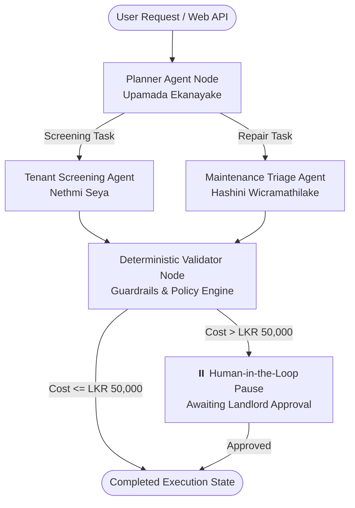

# Rental Management System (RMS) — Member File Breakdown & Architecture Guide

This guide provides a clear, simple English explanation of:
1. **Which files belong to which team member**, and **what each file does**.
2. A detailed explanation of how each member implemented their component across the **3 Core Subsystems**:
   - 🐘 **ASP.NET Core Web API & PostgreSQL**
   - ⚛️ **React Web Frontend**
   - 🤖 **LangGraph AI Subsystem**

---

# Quick Summary of Members & Components

| Member | Student ID | Academic Role | Assigned Component | Primary Hardware / AI Feature |
| :--- | :--- | :--- | :--- | :--- |
| **Upamada Ekanayake** | `IT24200314` | **Group Leader** | **Component A**: Property Listing & Lease Lifecycle Management | Master Planning Agent + Solution Architecture |
| **Nethmi Seya** | `IT24200314-M2` (`seyawidumini@gmail.com`) | **Member 2** | **Component B**: Tenant Screening & Risk Scoring | Camera KYC Verification + Risk Evaluation Engine |
| **Hashini Wicramathilake** | `IT24100427` | **Member 3** | **Component C**: Maintenance Triage & Dispatch Operations | GPS Geolocation Tagging + LKR 50K Human-in-the-Loop |

---

# PART 1: File-by-File Breakdown for Each Member

---

## 👤 Member 1: Upamada Ekanayake (Group Leader — IT24200314)
**Assigned Area**: *Component A: Property Listing & Lease Lifecycle Management & Core Architecture*

### 📁 Backend & Database Files (ASP.NET Core & PostgreSQL)
1. `backend/RMS.Core/Entities/Property.cs`
   - **What it does in simple English**: Defines what a **Property** (house/apartment) and a **Lease** (rental agreement) look like in code. It specifies details like address, monthly rent, security deposit, start date, end date, and status (`Available`, `Occupied`, `UnderMaintenance`, `Active`, `Terminated`).
2. `backend/RMS.Core/Entities/BaseEntity.cs`
   - **What it does in simple English**: The foundation class that gives every entity an automatic unique ID (`Guid Id`), `CreatedAt` timestamp, and `UpdatedAt` timestamp.
3. `backend/RMS.Core/Exceptions/DomainExceptions.cs`
   - **What it does in simple English**: Custom error messages for business rule violations (for example: trying to lease a property that is already occupied, or trying to set a negative rent).
4. `backend/RMS.Core/DTOs/PropertyDtos.cs`
   - **What it does in simple English**: Clean data packages (Data Transfer Objects) sent between the frontend and backend when creating, editing, or viewing properties and lease contracts.
5. `backend/RMS.Core/Interfaces/IPropertyLeaseService.cs`
   - **What it does in simple English**: The contract listing all operations for properties and leases (e.g., `GetAvailablePropertiesAsync`, `CreateLeaseAsync`, `TerminateLeaseAsync`).
6. `backend/RMS.Infrastructure/Services/PropertyLeaseService.cs`
   - **What it does in simple English**: Contains the actual business logic for managing leases and properties. When a lease is signed, it automatically changes the property status from `Available` to `Occupied`. When a lease is terminated early, it updates the property back to `Available`.
7. `backend/RMS.Infrastructure/Data/AppDbContext.cs`
   - **What it does in simple English**: The bridge between C# and PostgreSQL. Configures database tables, primary keys, relationships, seed data, and decimal precision.
8. `backend/RMS.API/Controllers/PropertiesController.cs`
   - **What it does in simple English**: The web API endpoints for properties (HTTP `GET /api/properties`, `POST /api/properties`, `GET /api/properties/{id}`).
9. `backend/RMS.API/Controllers/LeasesController.cs`
   - **What it does in simple English**: Web API endpoints for lease agreements (HTTP `POST /api/leases` to create, `POST /api/leases/{id}/terminate` to end a lease early).
10. `backend/RMS.API/Program.cs`
    - **What it does in simple English**: The entry point of the backend server. Sets up CORS, Swagger API documentation, dependency injection, and database connection.
11. `backend/RMS.Tests/PropertyLeaseServiceTests.cs`
    - **What it does in simple English**: Automated xUnit unit tests verifying that property and lease lifecycle rules work correctly without errors.

### 📁 Frontend Files (React 19 Web)
12. `frontend/src/components/properties/PropertyList.jsx`
    - **What it does in simple English**: The main property catalog dashboard. Shows search bar, status filters (`All`, `Available`, `Occupied`), and rental price range filters.
13. `frontend/src/components/properties/PropertyCard.jsx`
    - **What it does in simple English**: A visual card showing a property's photo, title, address, monthly rent in LKR, status badge, and "Create Lease" action button.
14. `frontend/src/components/properties/LeaseModal.jsx`
    - **What it does in simple English**: A popup form where the property manager creates a new lease contract, chooses dates, calculates security deposit, and submits digital signatures.
15. `frontend/src/components/layout/Header.jsx` & `Sidebar.jsx`
    - **What it does in simple English**: The navigation layout shell of the dashboard, allowing users to switch between Properties, Tenant Screening, and Maintenance.
16. `frontend/src/components/common/MetricsOverview.jsx`
    - **What it does in simple English**: The top KPI ribbon displaying total active properties, occupancy rate percentage, pending applications, and open maintenance tickets.

### 📁 AI Subsystem Files (LangGraph Python)
17. `ai-agent/agents/planner.py`
    - **What it does in simple English**: The "brain" / master planning agent. Analyzes user requests, breaks complex rental tasks into sub-steps, and routes work to the right specialist agent.
18. `ai-agent/workflow.py`
    - **What it does in simple English**: Sets up the LangGraph `StateGraph` connecting Planner -> Tenant Agent -> Maintenance Agent -> Validator Node.
19. `ai-agent/models/state.py`
    - **What it does in simple English**: Defines the shared memory (State) dictionary passed between all AI nodes during an execution run.
20. `ai-agent/main.py`
    - **What it does in simple English**: The FastAPI web service that listens for requests from ASP.NET Core and runs the LangGraph AI workflow.

### 📁 Mobile Files (Flutter 3.24)
21. `mobile/lib/screens/explore/property_list_screen.dart`
    - **What it does in simple English**: Mobile property browsing screen with search filters, smooth Hero image animations, and lease details.
22. `mobile/lib/screens/explore/active_lease_screen.dart`
    - **What it does in simple English**: Mobile screen allowing tenants to view their active signed lease, payment deadlines, and PDF contract.

---

## 👤 Member 2: Nethmi Seya (Member 2 — seyawidumini@gmail.com)
**Assigned Area**: *Component B: Tenant Screening & Risk Evaluation Management*

### 📁 Backend & Database Files (ASP.NET Core & PostgreSQL)
1. `backend/RMS.Core/Entities/TenantProfile.cs`
   - **What it does in simple English**: Database entity storing tenant KYC data: Full Name, NIC/Passport number, Monthly Income, Employment Status, Credit Score, Calculated Risk Score (`0-100`), and Risk Classification (`LowRisk`, `MediumRisk`, `HighRisk`).
2. `backend/RMS.Core/DTOs/TenantDtos.cs`
   - **What it does in simple English**: Defines the data transfer format for `TenantApplicationRequest` and `TenantEvaluationResponse` (income-to-rent ratio, risk flags, recommended security deposit).
3. `backend/RMS.Core/Interfaces/ITenantScreeningService.cs`
   - **What it does in simple English**: Interface specifying tenant evaluation methods (`EvaluateTenantRiskAsync`, `SubmitApplicationAsync`, `GetApplicationsByPropertyAsync`).
4. `backend/RMS.Infrastructure/Services/TenantScreeningService.cs`
   - **What it does in simple English**: The mathematical risk engine. It computes rent-to-income percentage:
     - If rent is **≤ 35%** of monthly income & credit score > 700 ➔ **Low Risk (Score 15-30)**
     - If rent is between **35% and 50%** ➔ **Medium Risk (Score 31-65)** (requires extra deposit or guarantor)
     - If rent is **> 50%** of monthly income ➔ **High Risk (Score > 65)** (rejected or requires landlord override).
5. `backend/RMS.API/Controllers/TenantScreeningController.cs`
   - **What it does in simple English**: HTTP endpoints (`POST /api/tenantscreening/evaluate`, `POST /api/tenantscreening/apply`, `GET /api/tenantscreening/applications`) to submit and audit tenant applications.
6. `backend/RMS.Tests/TenantScreeningServiceTests.cs`
   - **What it does in simple English**: Unit tests verifying that the 35% and 50% income-to-rent threshold calculations and credit score weights produce accurate risk categories.

### 📁 Frontend Files (React 19 Web)
7. `frontend/src/components/tenants/TenantReviewPortal.jsx`
   - **What it does in simple English**: The manager's review dashboard. Displays all incoming tenant applications in a table with risk gauges, monthly income, requested property, and "Approve" / "Reject" buttons.
8. `frontend/src/components/tenants/RiskScoreBadge.jsx`
   - **What it does in simple English**: A visual color-coded pill badge displaying:
     - 🟢 **Low Risk** (Green badge, checkmark)
     - 🟡 **Medium Risk** (Amber badge, warning icon)
     - 🔴 **High Risk** (Red badge, alert icon)
9. `frontend/src/components/tenants/IdentityVerificationModal.jsx`
   - **What it does in simple English**: A modal showing the tenant's scanned National Identity Card (NIC) or passport photo and automated identity match verification status.

### 📁 AI Subsystem Files (LangGraph Python)
10. `ai-agent/agents/tenant_agent.py`
    - **What it does in simple English**: Specialized AI node that reviews tenant employment history, financial ratios, and previous landlord references, generating an AI summary recommendation for the property manager.

### 📁 Mobile Files (Flutter 3.24)
11. `mobile/lib/screens/onboarding/tenant_application_screen.dart`
    - **What it does in simple English**: Mobile application form for prospective tenants. Features **Camera KYC** integration allowing applicants to take live photos of their NIC / Passport and upload salary slips.
12. `mobile/lib/screens/onboarding/application_status_screen.dart`
    - **What it does in simple English**: Live tracking screen for tenants showing whether their application is `Under Review`, `Approved`, or `Lease Ready`.

---

## 👤 Member 3: Hashini Wicramathilake (Member 3 — IT24100427)
**Assigned Area**: *Component C: Maintenance Triage & Work-Order Operations*

### 📁 Backend & Database Files (ASP.NET Core & PostgreSQL)
1. `backend/RMS.Core/Entities/MaintenanceTicket.cs`
   - **What it does in simple English**: Defines the **MaintenanceTicket** database model with title, description, trade category enum (`Plumbing`, `Electrical`, `HVAC`, `Carpentry`, `Roofing`), priority enum, `EstimatedCost`, `RequiresLandlordApproval`, `Latitude`, `Longitude`, and contractor ID.
2. `backend/RMS.Core/DTOs/MaintenanceDtos.cs`
   - **What it does in simple English**: DTOs for submitting repair tickets, returning AI triage estimates, assigning contractors, and handling high-cost landlord approvals.
3. `backend/RMS.Core/Interfaces/IMaintenanceService.cs`
   - **What it does in simple English**: Interface for maintenance actions (`SubmitTicketAsync`, `TriageTicketAsync`, `ApproveHighCostTicketAsync`, `DispatchContractorAsync`).
4. `backend/RMS.Infrastructure/Services/MaintenanceService.cs`
   - **What it does in simple English**: Business logic for maintenance triage:
     - Analyzes description text keywords to classify trade category (e.g., "pipe leak" ➔ Plumbing).
     - **LKR 50,000 Rule**: If estimated repair cost **exceeds LKR 50,000**, it sets `RequiresLandlordApproval = true` and freezes contractor dispatch until the landlord formally approves.
5. `backend/RMS.API/Controllers/MaintenanceController.cs`
   - **What it does in simple English**: Web API endpoints (`POST /api/maintenance/tickets`, `GET /api/maintenance/tickets`, `POST /api/maintenance/{id}/approve`, `POST /api/maintenance/{id}/dispatch`).
6. `backend/RMS.Tests/MaintenanceServiceTests.cs`
   - **What it does in simple English**: xUnit tests validating that tickets below LKR 50,000 dispatch automatically, while tickets ≥ LKR 50,000 require manual landlord approval.

### 📁 Frontend Files (React 19 Web)
7. `frontend/src/components/maintenance/MaintenanceBoard.jsx`
   - **What it does in simple English**: Kanban maintenance tracking board with columns for `Reported`, `Triaged / In Review`, `Dispatched`, and `Resolved`.
8. `frontend/src/components/maintenance/HighCostApprovalCard.jsx`
   - **What it does in simple English**: A highlighted alert card that pops up whenever a repair costs more than **LKR 50,000**, showing cost breakdown and "Authorize Repair" button.
9. `frontend/src/components/maintenance/ContractorDispatchModal.jsx`
   - **What it does in simple English**: Modal allowing managers to choose from licensed Sri Lankan contractors filtered by specialty (e.g., certified plumber, licensed electrician).
10. `frontend/src/components/properties/AiExecutionTrace.jsx`
    - **What it does in simple English**: A live telemetry drawer showing the step-by-step thinking of the LangGraph AI agent, tool executions, and approval pauses.

### 📁 AI Subsystem Files (LangGraph Python)
11. `ai-agent/agents/maintenance_agent.py`
    - **What it does in simple English**: AI triage specialist that analyzes repair damage descriptions and photos to estimate repair costs in LKR.
12. `ai-agent/agents/validator.py`
    - **What it does in simple English**: The safety check node. Inspects the AI output against deterministic rules: if cost > 50,000 LKR, it triggers a **Human-in-the-Loop (HITL) pause**, halting autonomous execution until a human confirms.
13. `ai-agent/tools/allowlisted_tools.py`
    - **What it does in simple English**: Strictly defined, safe tools the AI can execute (e.g., `calculate_estimated_cost`, `fetch_contractors_by_trade`).

### 📁 Mobile Files (Flutter 3.24)
14. `mobile/lib/screens/maintenance/create_ticket_screen.dart`
    - **What it does in simple English**: Ticket creation screen for tenants with **GPS Geolocation tagging** (records device latitude and longitude to verify the repair is at the actual property) and photo attachments.
15. `mobile/lib/services/location_service.dart`
    - **What it does in simple English**: Device GPS service utilizing `geolocator` plugin to request location permissions and fetch device GPS coordinates.

---

# PART 2: Deep Dive into the 3 Core Subsystems for Each Member

---

## 🐘 1. ASP.NET Core API & PostgreSQL

### 👤 Upamada Ekanayake (Component A)
- **Entities & Schema**:
  - `Property`: Stored in table `Properties`. Holds title, description, address, monthly rent, security deposit, and `PropertyStatus` enum (`Available`, `Occupied`, `UnderMaintenance`, `Inactive`).
  - `Lease`: Stored in table `Leases`. Foreign key references `PropertyId` and `TenantId`. Stores contract duration (`StartDate`, `EndDate`), agreed rent, and `LeaseStatus`.
- **Database & EF Core Configuration**:
  - In `AppDbContext.cs`, configured one-to-many relationship (`Property.Leases`). Configured column types (`decimal(18,2)` for currency) and initialized realistic seed data for Colombo properties.
- **Service Logic & Business Rules**:
  - `PropertyLeaseService.cs` enforces that a property cannot be leased if its status is not `Available`.
  - When `TerminateLeaseAsync` is called, the service marks the lease as `Terminated` and reverts the property status back to `Available`.
- **Controllers & DTOs**:
  - `PropertiesController` and `LeasesController` use DTOs (`PropertyResponseDto`, `CreateLeaseRequestDto`) with model validation attributes (`[Required]`, `[Range]`) and XML documentation for OpenAPI/Swagger.

### 👤 Nethmi Seya (Component B)
- **Entities & Schema**:
  - `TenantProfile`: Stored in table `TenantProfiles`. Contains applicant's personal identification, monthly income, employment status, credit score, and calculated risk metrics.
- **Database & EF Core Configuration**:
  - Configured in `AppDbContext.cs` with foreign key linking applicant to their prospective property.
- **Service Logic & Business Rules (The Deterministic Risk Engine)**:
  - `TenantScreeningService.cs` executes a strict deterministic mathematical formula:
    - **Income-to-Rent Ratio** = `(Monthly Rent / Monthly Income) * 100%`
    - **≤ 35%**: Pass. Low Risk classification.
    - **35% - 50%**: Caution. Medium Risk classification (conditional acceptance with 2x security deposit).
    - **> 50%**: Fail. High Risk classification (potential rent default risk).
  - Credit score weighting: Scores above 700 reduce risk by 20 points; scores below 550 add 30 risk points.
- **Controllers & DTOs**:
  - `TenantScreeningController` exposes `POST /api/tenantscreening/evaluate` taking `TenantEvaluationRequestDto` and returning `TenantEvaluationResponseDto` with breakdown factors.

### 👤 Hashini Wicramathilake (Component C)
- **Entities & Schema**:
  - `MaintenanceTicket`: Stored in table `MaintenanceTickets`. Contains description, trade category enum (`Plumbing`, `Electrical`, `HVAC`, etc.), priority enum, `EstimatedCost`, `RequiresLandlordApproval`, `Latitude`, `Longitude`, and contractor ID.
- **Database & EF Core Configuration**:
  - Enforces decimal precision for `EstimatedCost` and foreign key reference to `Properties`.
- **Service Logic & Business Rules (LKR 50,000 Landlord Threshold)**:
  - `MaintenanceService.cs` analyzes the ticket's repair cost:
    - If `EstimatedCost <= 50000`: Ticket status is set to `Triaged` and can be immediately dispatched to an available contractor.
    - If `EstimatedCost > 50000`: Ticket status is set to `PendingApproval` and `RequiresLandlordApproval = true`. Any attempt to dispatch without approval throws `InvalidOperationException`.
- **Controllers & DTOs**:
  - `MaintenanceController` exposes endpoints for ticket submission, trade triage, high-cost approval, and contractor dispatch.

---

## ⚛️ 2. React Web Frontend

### 👤 Upamada Ekanayake (Component A)
- **UI Architecture & Design System**:
  - Built using React 19 and Tailwind CSS with a modern dark theme ("Zinc" color palette: `#09090b` background, `#27272a` hairline borders, and `#18181b` card surfaces).
- **Core Components**:
  - `PropertyList.jsx`: Provides real-time debounced search, status filter pills (`All`, `Available`, `Occupied`), and rental price range sliders.
  - `PropertyCard.jsx`: Displays property image, rental rate in Sri Lankan Rupees (`LKR 185,000 / mo`), occupancy badges, and primary action buttons.
  - `LeaseModal.jsx`: Clean modal dialog allowing property managers to draft and execute leases with automatic security deposit calculations (e.g., 3 months rent upfront).
  - `MetricsOverview.jsx`: Top KPI mini-ribbon showing active properties, occupancy percentage, and total portfolio valuation.

### 👤 Nethmi Seya (Component B)
- **UI Components & Landlord Review Workflow**:
  - `TenantReviewPortal.jsx`: Dedicated review console for property managers. Lists all applicant dossiers with applicant name, income, requested property, and calculated risk tier.
  - `RiskScoreBadge.jsx`: Dynamic visual badge component that automatically changes color:
    - Green pill for Low Risk (Score < 30)
    - Amber pill for Medium Risk (Score 30–65)
    - Red pill for High Risk (Score > 65)
  - `IdentityVerificationModal.jsx`: Interactive modal for inspecting KYC documents (NIC front/back photo, passport scan, and employer salary confirmation).

### 👤 Hashini Wicramathilake (Component C)
- **UI Components & Maintenance Operations**:
  - `MaintenanceBoard.jsx`: Kanban-style visual tracking board dividing work orders into 4 distinct swimlanes:
    1. *Reported* (Newly submitted by tenants)
    2. *Triaged / Under Review* (Category & cost estimated)
    3. *Dispatched* (Contractor assigned)
    4. *Resolved* (Completed & verified)
  - `HighCostApprovalCard.jsx`: Prominent warning banner that appears when a ticket's estimated cost exceeds **LKR 50,000**. Highlights the reason for high cost and provides a single-click "Authorize Emergency Budget" action.
  - `ContractorDispatchModal.jsx`: Contractor picker modal that automatically filters contractors by required trade (e.g., showing only verified plumbers for a burst pipe).
  - `AiExecutionTrace.jsx`: Real-time slide-over panel displaying the agent's thought process, tool invocations, and approval checkpoints.

---

## 🤖 3. LangGraph AI Subsystem

### 👤 Upamada Ekanayake (Component A)
- **Master Planner Node (`ai-agent/agents/planner.py`)**:
  - Functions as the chief orchestrator. It receives raw natural language prompts (e.g., *"Tenant John applied for Apartment 4B and reported a water leak in the kitchen"*).
  - Decomposes complex multi-intent requests into discrete operational tasks and creates an execution plan.
- **LangGraph StateGraph & Workflow (`ai-agent/workflow.py`)**:
  - Configures the nodes and conditional edges using LangGraph `StateGraph(AgentState)`.
  - Determines routing logic: sends tenant verification tasks to `tenant_agent`, maintenance tasks to `maintenance_agent`, and output to `validator`.
- **FastAPI Integration Server (`ai-agent/main.py`)**:
  - Exposes endpoint `POST /api/orchestrator/run` that connects the ASP.NET Core backend to the LangGraph AI workflow asynchronously.

### 👤 Nethmi Seya (Component B)
- **Tenant Screening Agent Node (`ai-agent/agents/tenant_agent.py`)**:
  - Specialized agent node prompted with tenant evaluation rules.
  - Reviews applicant financial profiles, verifies KYC metadata, checks debt-to-income benchmarks, and generates a structured evaluation report in the shared state.
  - Uses allow-listed tools to query credit scoring ranges and historical tenant profiles.

### 👤 Hashini Wicramathilake (Component C)
- **Maintenance Triage Agent Node (`ai-agent/agents/maintenance_agent.py`)**:
  - Ingests maintenance ticket text (e.g., *"Severe sparking behind the living room AC unit"*).
  - Automatically identifies the trade (`Electrical`), assigns urgency (`High / Emergency`), and estimates repair costs in LKR.
- **Deterministic Validator & HITL Pause Node (`ai-agent/agents/validator.py`)**:
  - Serves as the safety firewall between AI recommendations and execution.
  - **Human-in-the-Loop (HITL) Check**: If the estimated cost exceeds **LKR 50,000**, the validator overrides the status to `NEEDS_HUMAN_APPROVAL` and pauses the LangGraph execution graph. The system will NOT dispatch a contractor until the landlord submits approval via the React dashboard.

---

# Summary Checklist for Viva & Grading

| Topic | Upamada Ekanayake | Nethmi Seya | Hashini Wicramathilake |
| :--- | :--- | :--- | :--- |
| **Component** | Property & Lease Lifecycle | Tenant Screening & Risk | Maintenance & Operations |
| **Main Entity** | `Property`, `Lease` | `TenantProfile` | `MaintenanceTicket` |
| **Core Business Rule** | Property must be `Available` to lease; reverting status on termination | Rent-to-income ratio (35% & 50% thresholds) | LKR 50,000 repair threshold for landlord approval |
| **React View** | `PropertyList`, `LeaseModal` | `TenantReviewPortal`, `RiskScoreBadge` | `MaintenanceBoard`, `HighCostApprovalCard` |
| **AI Role** | Master Planner & Orchestration Graph | Tenant Risk Screening Specialist | Maintenance Triage & HITL Pause Node |
| **Mobile Integration** | Hero Animations & Property Explorer | Camera KYC Document Capture | GPS Geolocation Coordinates Tagging |
