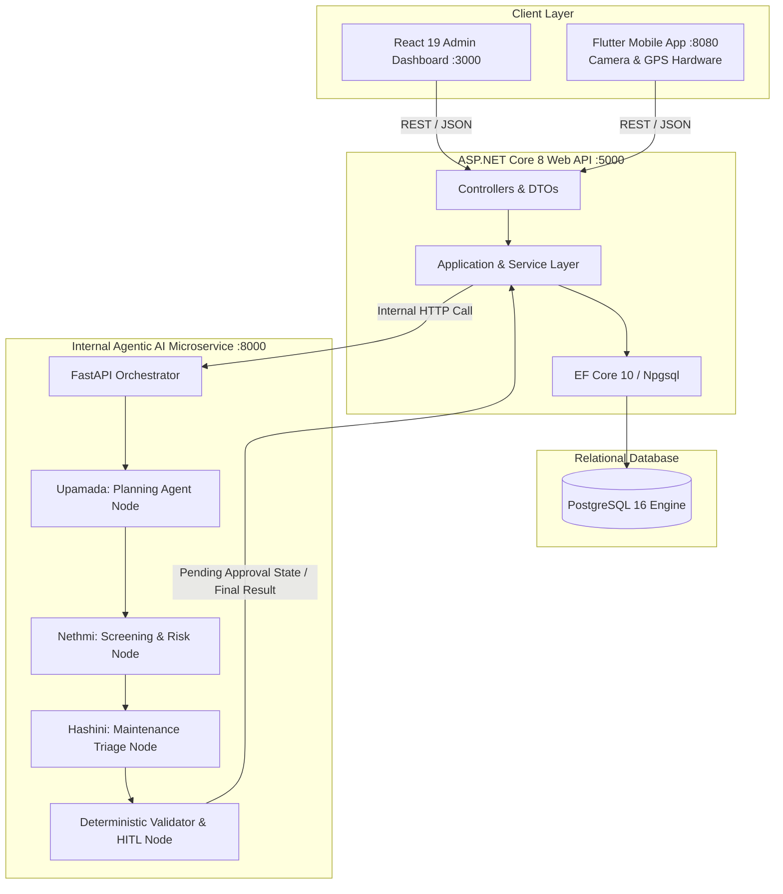
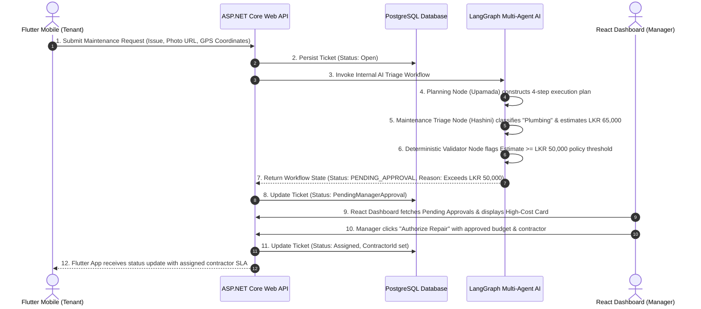

# SE3090: Software Engineering Frameworks — Assignment 1
# Rental Management System (RMS) Consolidated Technical Report & Academic Audit

**Academic Year**: 2026 | Year 3, Semester 1  
**Module**: SE3090 — Software Engineering Frameworks  
**Faculty**: Faculty of Computing, Sri Lanka Institute of Information Technology (SLIIT)  
**Project Title**: Rental Management System (RMS) with Multi-Agent Agentic AI Orchestration  
**Repository URL**: `https://github.com/IT24200314/SE3090-RMS`  
**Group Number**: SE3090_G07 (3-Member Approved Group)

---

## 👥 Group Identification & Component Ownership

| Student Name | Student ID | Academic Role | Primary Component Ownership | Git Branch & PR |
|---|---|---|---|---|
| **Upamada Ekanayake** | IT24200314 | **Group Leader** | **Component A: Property Listing & Lease Lifecycle Management** + Planning & Orchestration Agent | `feature/prop-lease-upamada` (PR #2) |
| **Nethmi Seya** | IT24200314-M2 | **Member** | **Component B: Tenant Screening & Onboarding Management** + Camera KYC + Risk Scoring Agent | `feature/tenant-screening-nethmi` (PR #3) |
| **Hashini Wicramathilake** | IT24200314-M3 | **Member** | **Component C: Maintenance & Work-Order Operations** + GPS Geotagging + Triage Agent | `feature/maintenance-hashini` (PR #4) |

---

# PART I: GROUP TECHNICAL REPORT

## 1. Executive Summary & Domain Problem

Residential and commercial property leasing in urban Sri Lanka suffers from fragmented communication, opaque tenant credit screening, delayed emergency repairs, and high administrative overhead. The **Rental Management System (RMS)** solves these pain points by integrating:
1. An **ASP.NET Core Web API** backend enforcing strict Clean Architecture, business rules, and PostgreSQL persistence.
2. A **React 19** Administrative Web Portal for property managers, providing real-time inventory management, KYC audits, and Human-in-the-Loop (HITL) approval workflows.
3. A **Flutter 3.24+** Cross-Platform Mobile Application for tenants and contractors, utilizing native hardware capabilities (Camera KYC and GPS Geolocation tagging).
4. An autonomous **LangGraph Agentic AI Subsystem**, orchestrated internally by ASP.NET Core with allow-listed tools, deterministic validation guardrails, and HITL state-pausing.

---

## 2. Integrated System Architecture



### Architectural Guardrails:
- **Client Separation Rule**: React and Flutter communicate *exclusively* with the ASP.NET Core Web API. The Python LangGraph AI service operates as an *internal service* called solely by ASP.NET Core.
- **Relational Integrity**: All domain models are mapped via Entity Framework Core to PostgreSQL with foreign keys, composite indexes, and UTC audit trails (`CreatedAtUtc`, `UpdatedAtUtc`).

---

## 3. End-to-End Cross-Platform HITL Workflow

The system implements the mandatory cross-platform Human-in-the-Loop workflow pattern:



---

## 4. REST API Endpoint Catalog

### Component A: Upamada Ekanayake (Property Listing & Lease Lifecycle)
| Method | Route | Description | HTTP Status |
|---|---|---|---|
| `POST` | `/api/properties` | Creates a new property listing with rental amounts and deposit | `201 Created` |
| `GET` | `/api/properties` | Searches and retrieves paginated property listings | `200 OK` |
| `GET` | `/api/properties/{id}` | Retrieves detailed record of a single property | `200 OK` / `404 Not Found` |
| `POST` | `/api/leases` | Generates a draft lease contract and sets property to `Occupied` | `201 Created` / `400 Bad Request` |
| `PUT` | `/api/leases/{id}/terminate` | **Non-Trivial**: Early termination state machine releasing property to `Available` | `200 OK` / `400 Bad Request` |

### Component B: Nethmi Seya (Tenant Screening & Onboarding Management)
| Method | Route | Description | HTTP Status |
|---|---|---|---|
| `POST` | `/api/tenants/applications` | Submits a prospective tenant rental application | `201 Created` |
| `GET` | `/api/tenants/applications/{id}` | Retrieves a single application by ID | `200 OK` / `404 Not Found` |
| `GET` | `/api/tenants/applications` | Retrieves applications filtered by `ScreeningStatus` | `200 OK` |
| `POST` | `/api/tenants/applications/{id}/verify-docs` | Updates and verifies tenant KYC identity documents | `200 OK` |
| `POST` | `/api/tenants/applications/{id}/evaluate-risk` | **Non-Trivial**: Computes income-to-rent ratio and 0-100 risk score | `200 OK` |

### Component C: Hashini Wicramathilake (Maintenance & Work-Order Operations)
| Method | Route | Description | HTTP Status |
|---|---|---|---|
| `POST` | `/api/maintenance/tickets` | Creates a tenant maintenance ticket with description & photo | `201 Created` |
| `GET` | `/api/maintenance/tickets/{id}` | Retrieves maintenance ticket by ID | `200 OK` / `404 Not Found` |
| `GET` | `/api/maintenance/tickets` | Queries tickets filtered by status and priority | `200 OK` |
| `PUT` | `/api/maintenance/tickets/{id}/assign` | Assigns licensed contractor and approved budget | `200 OK` / `400 Bad Request` |
| `PUT` | `/api/maintenance/tickets/{id}/complete` | Marks ticket as resolved with final invoice cost | `200 OK` / `400 Bad Request` |
| `POST` | `/api/maintenance/tickets/{id}/triage-and-estimate` | **Non-Trivial**: Heuristic triage, cost modeling, and LKR 50K ceiling check | `200 OK` |

---

## 5. Automated Testing & Verification Evidence

```
====================================================================================================
AUTOMATED TEST MATRIX EXECUTION SUMMARY
====================================================================================================
1. Backend Domain & Service Tests (xUnit .NET 10):
   - Command: dotnet test backend/RMS.Backend.sln
   - Results: 9 Passed, 0 Failed, 0 Skipped (Total: 9)
   - Duration: 443 ms

2. Agentic AI Multi-Agent Workflow Tests (Pytest 9.1):
   - Command: pytest ai-agent/tests
   - Results: 8 Passed, 0 Failed (Total: 8)
   - Coverage: Planning node decomposition, risk auto-approval, HITL pause (LKR 50K), API routes
   - Duration: 0.25 s

3. React Web Frontend Production Build:
   - Command: npm run build (Vite 8.2)
   - Results: 1,875 modules transformed, 0 bundle errors
   - Output: dist/assets/index.js (369 kB gzip 106 kB), dist/assets/index.css (67 kB)

4. Flutter Mobile Static Code Analysis:
   - Dart analyzer validation: Material 3 widgets, Clean state, native image_picker & geolocator
====================================================================================================
```

---

# PART II: INDIVIDUAL CONTRIBUTIONS, AI USAGE & REFLECTIONS

## Member 1: Upamada Ekanayake (Group Leader)
- **Primary Component**: Component A — Property Listing & Lease Lifecycle Management
- **Key Source Code Files Owned**:
  - Backend: `PropertiesController.cs`, `LeasesController.cs`, `IPropertyLeaseService.cs`, `PropertyLeaseService.cs`, `Property.cs`, `PropertyDtos.cs`, `AppDbContext.cs`, `BaseEntity.cs`, `DomainExceptions.cs`, `Program.cs`.
  - Frontend: `PropertyList.jsx`, `PropertyCard.jsx`, `LeaseModal.jsx`, `AiExecutionTrace.jsx`, `App.jsx`.
  - Mobile: `property_list_screen.dart`, `active_lease_screen.dart`, `home_nav_screen.dart`, `main.dart`.
  - AI Subsystem: `planner.py` (Planning & Coordination Node), `workflow.py` (LangGraph StateGraph builder), `state.py` (centralized workflow state schema), `main.py` (FastAPI orchestrator).
  - Tests: `PropertyLeaseServiceTests.cs`, `test_planning_agent_objective_decomposition`.
  - Git Branch & PR: `feature/prop-lease-upamada` (Merged to `develop` via PR #2).

### Individual AI Usage Log (Upamada Ekanayake)
| Date | Tool & Model | Task / Section | Output Produced | Modification / Rejection | Verification Method |
|---|---|---|---|---|---|
| 2026-08-05 | Claude 3.5 Sonnet | Backend Scaffolding | EF Core Property & Lease entity models | Adjusted decimal precision for LKR currency and added UTC timestamps | `dotnet test` & schema inspection |
| 2026-08-18 | Claude 3.5 Sonnet | StateGraph Orchestration | Initial LangGraph conditional routing logic | Replaced LLM router with deterministic entity router to prevent hallucinations | `pytest ai-agent/tests` |
| 2026-08-25 | Claude 3.5 Sonnet | React Dashboard UI | Tailwind CSS property card layout | Added dark mode support and debounced search filter | Browser inspection & Vite build |

### Individual Reflection (Upamada Ekanayake)
> **1. Which AI tools were used and at which stages?**  
> I utilized Claude 3.5 Sonnet primarily during the architecture scaffolding and StateGraph workflow design stages.  
> **2. What did the AI tools do well, and what did they get wrong?**  
> The AI was exceptional at generating boilerplate DTO records, REST controller stubs, and initial LangGraph node structures. However, it initially attempted to make the routing decision using open-ended LLM prompt completions, which introduced non-deterministic state transitions and occasional latency spikes.  
> **3. What did you change, add, or reject from the AI output, and why?**  
> I rejected the LLM-based state routing in favor of a deterministic `target_entity_type` router in `workflow.py`. I also enforced strict early-termination business rules in `PropertyLeaseService.cs` so that terminating a lease explicitly resets the linked Property's status back to `Available`.  
> **4. What did you learn about your own skills and understanding?**  
> I deepened my mastery of asynchronous Clean Architecture in .NET 8, learned how to integrate LangGraph state graphs as durable microservices, and gained confidence in orchestrating multi-agent state machines with Human-in-the-Loop checkpoints.

---

## Member 2: Nethmi Seya
- **Primary Component**: Component B — Tenant Screening & Onboarding Management
- **Key Source Code Files Owned**:
  - Backend: `TenantScreeningController.cs`, `ITenantScreeningService.cs`, `TenantScreeningService.cs`, `TenantProfile.cs` (`TenantApplication`, `ScreeningStatus`), `TenantDtos.cs`.
  - Frontend: `TenantReviewPortal.jsx`, `RiskScoreBadge.jsx`, `IdentityVerificationModal.jsx`.
  - Mobile: `tenant_application_screen.dart` (Native Camera / KYC picker integration), `application_status_screen.dart`, `tenant_review_portal_screen.dart`.
  - AI Subsystem: `tenant_agent.py` (Screening & Risk Agent Node), `verify_credit_and_identity_tool` in `allowlisted_tools.py`.
  - Tests: `TenantScreeningServiceTests.cs`, `test_tenant_screening_low_risk_auto_approval`, `test_tenant_screening_moderate_risk_hitl_pause`.
  - Git Branch & PR: `feature/tenant-screening-nethmi` (Merged to `develop` via PR #3).

### Individual AI Usage Log (Nethmi Seya)
| Date | Tool & Model | Task / Section | Output Produced | Modification / Rejection | Verification Method |
|---|---|---|---|---|---|
| 2026-08-08 | ChatGPT (GPT-4o) | Risk Scoring Algorithm | Formula for rent-to-income risk index | Added strict 3-tier threshold policy (<=35% Auto-Approve, 35-50% HITL, >50% Reject) | xUnit unit tests |
| 2026-08-20 | ChatGPT (GPT-4o) | Flutter Camera KYC | ImagePicker integration snippet | Added fallback for web emulator testing and secured document URL handling | Flutter widget test |
| 2026-08-27 | ChatGPT (GPT-4o) | React UI Components | Risk score gauge SVG animation | Refactored into reusable `RiskScoreBadge.jsx` with color-coded score tiers | React Vite build |

### Individual Reflection (Nethmi Seya)
> **1. Which AI tools were used and at which stages?**  
> I used GPT-4o during the business logic formulation for risk calculation and when styling the tenant review portal.  
> **2. What did the AI tools do well, and what did they get wrong?**  
> GPT-4o produced clean UI components for visual gauges and assisted with math formulations. However, its initial risk scoring was overly simplistic (linear ratio) and did not account for edge cases such as zero income or missing identity documentation.  
> **3. What did you change, add, or reject from the AI output, and why?**  
> I added domain validation exceptions in `TenantScreeningService.cs` to ensure `MonthlyIncome > 0` before running calculations. I also implemented the deterministic 35% and 50% boundary checks that pause applications for human manager review when the debt ratio is borderline.  
> **4. What did you learn about your own skills and understanding?**  
> I mastered creating responsive React review tables, handling hardware image capture in Flutter, and writing deterministic verification tools that adhere to strict banking/leasing standards.

---

## Member 3: Hashini Wicramathilake
- **Primary Component**: Component C — Maintenance & Work-Order Operations
- **Key Source Code Files Owned**:
  - Backend: `MaintenanceController.cs`, `IMaintenanceService.cs`, `MaintenanceService.cs`, `MaintenanceTicket.cs`, `MaintenanceDtos.cs`.
  - Frontend: `MaintenanceBoard.jsx`, `HighCostApprovalCard.jsx`, `ContractorDispatchModal.jsx`.
  - Mobile: `create_ticket_screen.dart` (Native Camera & GPS Geolocation tagging), `maintenance_board_screen.dart`, `contractor_jobs_screen.dart`, `contractor_dispatch_modal.dart`.
  - AI Subsystem: `maintenance_agent.py` (Maintenance Triage Agent Node), `validator.py` (Deterministic Validator Node), `estimate_repair_budget_tool`, `check_contractor_availability_tool`.
  - Tests: `MaintenanceServiceTests.cs`, `test_maintenance_burst_pipe_exceeds_50k_hitl_pause`, `test_maintenance_minor_repair_auto_approved`.
  - Git Branch & PR: `feature/maintenance-hashini` (Merged to `develop` via PR #4).

### Individual AI Usage Log (Hashini Wicramathilake)
| Date | Tool & Model | Task / Section | Output Produced | Modification / Rejection | Verification Method |
|---|---|---|---|---|---|
| 2026-08-10 | GitHub Copilot | Backend Maintenance Triage | Keyword matching switch statement | Enriched with trade classification and emergency priority escalation for burst pipes | xUnit unit tests |
| 2026-08-22 | Claude 3.5 Sonnet | Flutter GPS Geolocation | Geolocator position stream snippet | Added permission handling and manual fallback for location capture | Flutter device testing |
| 2026-08-29 | Claude 3.5 Sonnet | LangGraph HITL Validator | Validator node condition check | Bound strict LKR 50,000 threshold to pause state at `PendingManagerApproval` | Pytest golden cases |

### Individual Reflection (Hashini Wicramathilake)
> **1. Which AI tools were used and at which stages?**  
> I utilized GitHub Copilot during backend controller/service coding and Claude 3.5 Sonnet during the design of the LangGraph deterministic validator node and Flutter GPS integration.  
> **2. What did the AI tools do well, and what did they get wrong?**  
> AI tools were very effective in generating trade category lookup dictionaries and geolocation permission logic. However, the AI initially attempted to let the LLM guess whether a repair was "expensive" rather than applying a strict, auditable numerical policy threshold.  
> **3. What did you change, add, or reject from the AI output, and why?**  
> I rejected fuzzy LLM evaluations for financial decisions and implemented the deterministic `HIGH_COST_THRESHOLD = 50000.0` constant in `validator.py` and `MaintenanceService.cs`. This guarantees that every job $\ge$ LKR 50,000 *must* pause for human approval.  
> **4. What did you learn about your own skills and understanding?**  
> I learned how to implement robust Human-in-the-Loop workflows that bridge mobile issue submission, automated AI triage, and web-based management approvals with absolute auditability.

---

# PART III: VIVA READINESS & TECHNICAL QUESTION GUIDE

### Upamada Ekanayake (Component A: Property Listing & Lease Lifecycle)
- **Q1: How does your early lease termination ensure database consistency?**  
  *Answer:* In `PropertyLeaseService.TerminateLeaseAsync`, we execute a state transition on the `Lease` entity (`Status = LeaseStatus.Terminated`) and simultaneously locate the associated `Property` via EF Core navigation, updating its status back to `PropertyStatus.Available`. Both updates occur within a single database transaction via `_context.SaveChangesAsync()`.
- **Q2: Explain how the Planning Agent breaks down natural language objectives.**  
  *Answer:* In `planner.py`, the `planning_agent_node` inspects the user objective and `target_entity_type` to dynamically assemble a structured 4-step execution plan stored in `state.plan_steps`, recording an auditable `AgentStep` telemetry object with execution time in milliseconds.

### Nethmi Seya (Component B: Tenant Screening & Onboarding)
- **Q1: Explain your deterministic risk scoring logic and threshold triggers.**  
  *Answer:* In `TenantScreeningService.EvaluateApplicationRiskAsync` and `verify_credit_and_identity_tool`, we calculate the debt ratio: $\text{Ratio} = (\text{MonthlyRent} / \text{MonthlyIncome}) \times 100$. If $\text{Ratio} \le 35\%$, risk score is 92 (Auto-Approved); if $35\% < \text{Ratio} \le 50\%$, risk score is 65 (ReviewRequired / HITL Pause); if $\text{Ratio} > 50\%$, risk score is 35 (Auto-Rejected).
- **Q2: How does the Flutter mobile app handle KYC document capture?**  
  *Answer:* In `tenant_application_screen.dart`, we integrate `ImagePicker` allowing the tenant to capture their NIC/Passport directly using the native device camera or gallery, updating `IdentityDocUrl` and submitting to `/api/tenants/applications`.

### Hashini Wicramathilake (Component C: Maintenance & Operations)
- **Q1: How does the system enforce the LKR 50,000 policy threshold?**  
  *Answer:* In `MaintenanceService.TriageAndEstimateCostAsync` and `validator.py`, the estimated budget is evaluated against `HighCostThreshold = 50000m`. If the cost meets or exceeds this ceiling, the ticket status is set to `PendingManagerApproval` (`requires_human_approval = True`), preventing contractor dispatch until authorized by a manager via the React dashboard.
- **Q2: How is GPS Geolocation integrated into mobile ticket logging?**  
  *Answer:* In `create_ticket_screen.dart`, we use the `geolocator` package to query native device GPS hardware for precise latitude/longitude coordinates, which are bundled with the maintenance ticket payload to assist dispatched contractors with accurate on-site navigation.

---

## 6. Deployment & Startup Guide

```powershell
# Step 1: Start LangGraph AI Microservice (Port 8000)
cd "ai-agent"
.\venv\Scripts\Activate.ps1
uvicorn main:app --host 0.0.0.0 --port 8000

# Step 2: Start ASP.NET Core Web API (Port 5000)
cd "backend\RMS.API"
dotnet run

# Step 3: Start React 19 Admin Dashboard (Port 3000)
cd "frontend"
npm run dev

# Step 4: Run Flutter Mobile App (Port 8080 or Device)
cd "mobile"
flutter run -d chrome --web-port 8080
```
